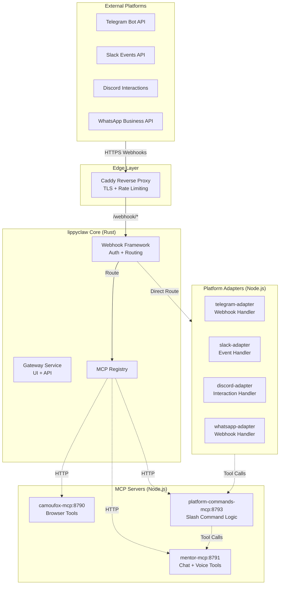
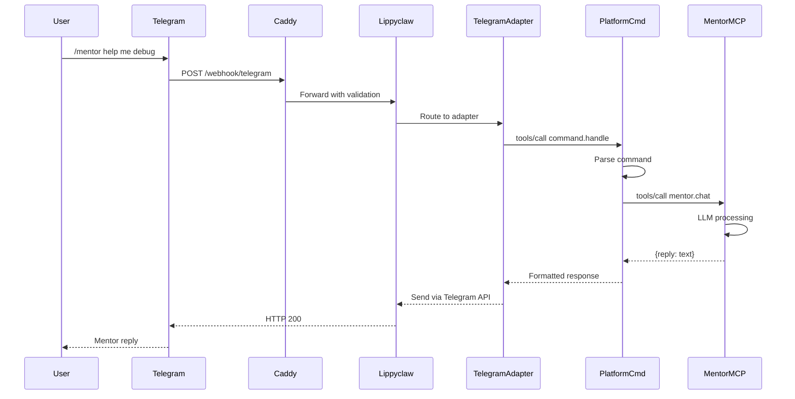

# Architectural Decision: Mentor & Multi-Platform Slash Command Integration

**Date:** 2026-03-02  
**Status:** Proposed  
**Deciders:** Technical Leadership  

---

## Executive Summary

This document analyzes whether mentor functionality and multi-platform slash command support should be:
1. **Embedded directly** into the lippyclaw (Ironclaw fork) Rust codebase
2. **Remain as separate MCP servers** (current architecture)

**Recommendation:** Adopt a **hybrid architecture** where:
- **Mentor remains as a separate MCP server** (Node.js) for decoupling and fault tolerance
- **Platform adapters are implemented as MCP servers** (Node.js), not embedded in Rust
- **Lippyclaw core provides a unified webhook routing framework** (Rust modifications required)
- **OpenAI-compatible LLM abstraction is leveraged** through existing infrastructure

---

## 1. Current Architecture Analysis

### 1.1 Ironclaw Core (Rust)

The Ironclaw gateway is built from source using Rust 1.92:

```
docker/Dockerfile.ironclaw
├── Rust builder image (rust:1.92-bookworm)
├── Patches libsql for TLS sync support
├── Patches MCP config.rs for internal Docker DNS resolution
└── Produces: /usr/local/bin/ironclaw binary
```

**Key characteristics:**
- Gateway service on port 8080
- Webhook HTTP channel on port 8090
- MCP client for registering external tool servers
- PostgreSQL for state persistence
- Built-in Telegram webhook handling (via ghostclaw orchestration)

### 1.2 Current MCP Servers (Node.js)

| Server | Port | Purpose | Technology |
|--------|------|---------|------------|
| [`camoufox-mcp`](docker/Dockerfile.camoufox-mcp:1-13) | 8790 | Browser automation tools | Node.js + Fastify |
| [`mentor-mcp`](docker/Dockerfile.mentor-mcp:1-13) | 8791 | Mentor persona + voice | Node.js + Fastify |
| `context7-mcp` | 8792 | Documentation lookup | Node.js |

**MCP Registration Flow:**
```bash
# From scripts/ghostclaw.sh:1216-1226
compose_local exec -T ironclaw mcp add camoufox http://camoufox-mcp:8790/mcp
compose_local exec -T ironclaw mcp add mentor http://mentor-mcp:8791/mcp
compose_local restart ironclaw  # Pick up new MCP servers
```

### 1.3 OpenAI-Compatible LLM Abstraction

The system uses OpenAI-compatible endpoints through:

1. **Ghostclaw orchestrator** ([`src/lib/openai-compatible.ts`](src/lib/openai-compatible.ts:41-189)):
   - TypeScript client for chat completions
   - Retry logic with exponential backoff
   - Supports any OpenAI-compatible provider

2. **Mentor MCP** ([`mentor-mcp/server.mjs`](mentor-mcp/server.mjs:275-317)):
   - Direct HTTP calls to `llmBaseUrl/chat/completions`
   - Uses `MAIN_LLM_BASE_URL`, `SUB_LLM_BASE_URL` environment variables
   - Voice processing via Chutes AI run endpoint

3. **Ironclaw core** (Rust):
   - `LLM_BACKEND=openai_compatible`
   - `LLM_BASE_URL`, `LLM_API_KEY`, `LLM_MODEL` environment variables

---

## 2. Architectural Options

### Option A: Full Embedding (Mentor + Platform Adapters in Rust)

```
┌─────────────────────────────────────────────────────────────┐
│                    lippyclaw (Rust)                         │
│  ┌─────────────┐  ┌─────────────┐  ┌─────────────────────┐  │
│  │   Gateway   │  │   Mentor    │  │  Platform Adapters  │  │
│  │   Service   │  │   Engine    │  │  (Telegram/Slack/   │  │
│  │             │  │  (Embedded) │  │   Discord/WhatsApp) │  │
│  └─────────────┘  └─────────────┘  └─────────────────────┘  │
│                                                             │
│  ┌─────────────────────────────────────────────────────────┐│
│  │              MCP Registry (External Tools Only)         ││
│  │         camoufox-mcp, context7-mcp, etc.                ││
│  └─────────────────────────────────────────────────────────┘│
└─────────────────────────────────────────────────────────────┘
```

**Pros:**
- Single binary deployment
- Lower latency (no HTTP between components)
- Tighter integration with Ironclaw core features
- Simplified observability (single log stream)

**Cons:**
- **Requires Rust development** - significant learning curve
- **Tight coupling** - mentor bugs can crash entire gateway
- **Slower iteration** - Rust compile times vs Node.js hot reload
- **Larger attack surface** - more code in privileged gateway process
- **Voice processing complexity** - audio handling in Rust is more complex
- **Breaks existing deployment patterns** - current Docker Compose setup assumes separate services

### Option B: Pure MCP (Current Architecture Enhanced)

```
┌─────────────────────────────────────────────────────────────┐
│                    lippyclaw (Rust)                         │
│  ┌─────────────┐  ┌─────────────────────────────────────┐   │
│  │   Gateway   │  │      Unified Webhook Router         │   │
│  │   Service   │  │  (routes to platform MCP servers)   │   │
│  └─────────────┘  └─────────────────────────────────────┘   │
│                            │                                  │
│                            ▼                                  │
│  ┌─────────────────────────────────────────────────────────┐ │
│  │              MCP Registry                               │ │
│  └─────────────────────────────────────────────────────────┘ │
└─────────────────────────────────────────────────────────────┘
         │              │              │
         ▼              ▼              ▼
┌─────────────┐ ┌─────────────┐ ┌─────────────────────────────┐
│camoufox-mcp │ │ mentor-mcp  │ │ platform-adapter-mcp        │
│  (Node.js)  │ │  (Node.js)  │ │  (Node.js - multi-platform) │
└─────────────┘ └─────────────┘ └─────────────────────────────┘
```

**Pros:**
- **No Rust coding required** - all adapters in Node.js
- **Fault isolation** - MCP server crash doesn't affect gateway
- **Independent scaling** - scale mentor separately from platform adapters
- **Faster iteration** - Node.js development cycle
- **Preserves current deployment patterns**
- **Voice processing stays in Node.js** (simpler audio handling)

**Cons:**
- HTTP overhead between components
- More containers to manage
- Network latency for tool calls
- More complex observability (distributed tracing needed)

### Option C: Hybrid (Recommended)

```
┌─────────────────────────────────────────────────────────────┐
│                    lippyclaw (Rust)                         │
│  ┌─────────────┐  ┌─────────────────────────────────────┐   │
│  │   Gateway   │  │  Platform Webhook Framework         │   │
│  │   Service   │  │  (Rust: routing + auth + rate limit)│   │
│  └─────────────┘  └─────────────────────────────────────┘   │
│                            │                                  │
│                            ▼                                  │
│  ┌─────────────────────────────────────────────────────────┐ │
│  │              MCP Registry                               │ │
│  └─────────────────────────────────────────────────────────┘ │
└─────────────────────────────────────────────────────────────┘
         │              │              │
         ▼              ▼              ▼
┌─────────────┐ ┌─────────────┐ ┌─────────────────────────────┐
│camoufox-mcp │ │ mentor-mcp  │ │ platform-commands-mcp       │
│  (Node.js)  │ │  (Node.js)  │ │  (Node.js - command logic)  │
└─────────────┘ └─────────────┘ └─────────────────────────────┘
                                       │
                                       ▼
                              ┌─────────────────┐
                              │ slack-adapter   │
                              │ discord-adapter │
                              │ whatsapp-adapter│
                              │ telegram-adapter│
                              └─────────────────┘
```

**Key decisions:**
1. **Mentor stays as MCP server** - decoupled, fault-tolerant, voice processing in Node.js
2. **Platform webhook framework in Rust** - secure entry point, authentication, rate limiting
3. **Platform command logic in MCP** - business logic stays decoupled
4. **Optional: Platform adapters as separate MCP servers** - one per platform for isolation

---

## 3. Security Analysis

### 3.1 Current Security Model

**Webhook Security** ([`src/index.ts`](src/index.ts:136-175)):
```typescript
app.post("/telegram/webhook", async (request, reply) => {
  const providedSecret = request.headers["x-telegram-bot-api-secret-token"];
  if (providedSecret !== appConfig.telegram.webhookSecret) {
    return sendError(reply, 401, "UNAUTHORIZED_WEBHOOK", ...);
  }
  // ... process message
});
```

**MCP Server Security:**
- Internal Docker network only (not exposed externally)
- No authentication between Ironclaw and MCP servers
- Relies on Docker network isolation

### 3.2 Security Implications by Option

| Threat | Option A (Embed) | Option B (Pure MCP) | Option C (Hybrid) |
|--------|------------------|---------------------|-------------------|
| **Webhook spoofing** | Same risk - secret token validation | Same risk | **Improved** - centralized auth in Rust |
| **MCP server compromise** | N/A (no MCP) | Contained to MCP process | Contained to MCP process |
| **Gateway compromise** | Full system compromise | MCP servers isolated | MCP servers isolated |
| **Voice data exposure** | In Rust process memory | In Node.js process | In Node.js process |
| **Rate limiting** | Must implement in Rust | Per-MCP implementation | **Centralized in Rust** |
| **Input validation** | Rust-level validation | Per-MCP validation | **Defense in depth** |

### 3.3 Recommended Security Model

**For external platform webhooks:**
```
┌──────────────┐     ┌─────────────────┐     ┌──────────────────┐
│   Platform   │────▶│  Caddy Reverse  │────▶│  lippyclaw       │
│   (Telegram, │     │  Proxy          │     │  Webhook         │
│   Slack,     │     │  (TLS, auth)    │     │  Framework       │
│   Discord)   │     └─────────────────┘     │  (Rust)          │
└──────────────┘                             └────────┬─────────┘
                                                      │
                    ┌─────────────────────────────────┤
                    │                                 │
                    ▼                                 ▼
           ┌────────────────┐              ┌──────────────────┐
           │  Rate Limiter  │              │  Secret Token    │
           │  (per-platform)│              │  Validation      │
           └────────────────┘              └──────────────────┘
                    │                                 │
                    └──────────────┬──────────────────┘
                                   ▼
                        ┌──────────────────┐
                        │  MCP Router      │
                        │  (to platform-   │
                        │   commands-mcp)  │
                        └──────────────────┘
```

**Key security controls:**
1. **Caddy reverse proxy** - TLS termination, basic auth option
2. **Secret token validation** - per-platform webhook secrets
3. **Rate limiting** - prevent abuse at gateway level
4. **Input sanitization** - validate platform payloads before MCP routing
5. **MCP isolation** - platform adapters run as separate processes

---

## 4. Rust vs Node.js Analysis

### 4.1 Does Ironclaw Rust Codebase Need Modification?

**Yes, for Option C (Hybrid):**

| Modification | Complexity | Rationale |
|--------------|------------|-----------|
| **Unified webhook router** | Medium | Route `/webhook/{platform}` to MCP handlers |
| **Platform authentication framework** | Medium | Validate secret tokens, API signatures |
| **Rate limiting middleware** | Low-Medium | Per-platform rate limits |
| **MCP registry enhancements** | Low | Support platform-specific MCP discovery |
| **No changes needed** | - | Option B (Pure MCP) works with current code |

**For Option B (Pure MCP) - No Rust changes required:**
- Current MCP protocol supports tool registration
- Platform adapters can register as MCP servers
- Webhook routing can be done at Caddy level

### 4.2 Can Mentor Be "Built-In" Without Embedding?

**Yes - "Built-In MCP" Pattern:**

```yaml
# docker-compose.yml
services:
  mentor-mcp:
    build:
      context: .
      dockerfile: docker/Dockerfile.mentor-mcp
    # Always started with ironclaw, but non-blocking
    restart: unless-stopped
    expose:
      - "8791"

  ironclaw:
    depends_on:
      postgres:
        condition: service_healthy
      # NOT mentor-mcp - register at runtime
    # Auto-register on startup
    command: ["run", "--auto-register-mcp=mentor,camoufox"]
```

**Characteristics:**
- Shipped with lippyclaw distribution
- Auto-registered on startup
- Non-blocking dependency (graceful degradation)
- Still decoupled (separate process)

---

## 5. OpenAI-Compatible LLM Abstraction

### 5.1 Current Implementation

**Environment Variables:**
```bash
# From .env.example
MAIN_LLM_BASE_URL=https://llm.chutes.ai/v1
MAIN_LLM_API_KEY=...
MAIN_LLM_MODEL=Qwen/Qwen3.5-397B-A17B-TEE

SUB_LLM_BASE_URL=https://llm.chutes.ai/v1
SUB_LLM_API_KEY=...
SUB_LLM_MODEL=MiniMaxAI/MiniMax-M2.5-TEE
```

**Usage in Mentor MCP** ([`mentor-mcp/server.mjs`](mentor-mcp/server.mjs:18-33)):
```javascript
const llmBaseUrl = (
  process.env.MENTOR_LLM_BASE_URL ||
  process.env.SUB_LLM_BASE_URL ||
  process.env.MAIN_LLM_BASE_URL ||
  "https://llm.chutes.ai/v1"
).replace(/\/$/, "");

const llmModel =
  process.env.MENTOR_LLM_MODEL ||
  process.env.SUB_LLM_MODEL ||
  process.env.MAIN_LLM_MODEL ||
  "MiniMaxAI/MiniMax-M2.5-TEE";
```

### 5.2 Multi-Platform Adapter LLM Usage

**Recommended pattern for platform adapters:**
```javascript
// platform-commands-mcp/server.mjs
const llmConfig = {
  baseUrl: process.env.PLATFORM_LLM_BASE_URL || 
           process.env.MAIN_LLM_BASE_URL,
  apiKey: process.env.PLATFORM_LLM_API_KEY || 
          process.env.MAIN_LLM_API_KEY,
  model: process.env.PLATFORM_LLM_MODEL || 
         process.env.MAIN_LLM_MODEL,
};

// Use same OpenAI-compatible client pattern as mentor-mcp
const callLLM = async (messages) => {
  const response = await fetch(`${llmConfig.baseUrl}/chat/completions`, {
    method: "POST",
    headers: {
      "content-type": "application/json",
      authorization: `Bearer ${llmConfig.apiKey}`,
    },
    body: JSON.stringify({
      model: llmConfig.model,
      messages,
      temperature: 0.2,
      max_tokens: 800,
    }),
  });
  // ... handle response
};
```

---

## 6. Recommended Architecture

### 6.1 High-Level Design



### 6.2 Component Responsibilities

| Component | Technology | Responsibility |
|-----------|------------|----------------|
| **lippyclaw Core** | Rust | Gateway, MCP registry, webhook auth/routing |
| **mentor-mcp** | Node.js | Chat persona, voice synthesis/transcription |
| **camoufox-mcp** | Node.js | Browser automation tools |
| **platform-commands-mcp** | Node.js | Slash command business logic |
| **platform-adapter-{name}** | Node.js | Platform-specific webhook handling |

### 6.3 Deployment Configuration

```yaml
# docker-compose.yml (excerpt)
services:
  lippyclaw:
    build:
      context: .
      dockerfile: docker/Dockerfile.lippyclaw
    environment:
      - GATEWAY_AUTH_TOKEN=${GATEWAY_AUTH_TOKEN}
      - MCP_AUTO_REGISTER=mentor,camoufox,platform-commands
      - WEBHOOK_SECRET_TELEGRAM=${TELEGRAM_WEBHOOK_SECRET}
      - WEBHOOK_SECRET_SLACK=${SLACK_SIGNING_SECRET}
      - WEBHOOK_SECRET_DISCORD=${DISCORD_PUBLIC_KEY}
      - WEBHOOK_SECRET_WHATSAPP=${WHATSAPP_VERIFY_TOKEN}
    depends_on:
      postgres:
        condition: service_healthy
      # MCP servers are OPTIONAL (non-blocking)

  mentor-mcp:
    build:
      context: .
      dockerfile: docker/Dockerfile.mentor-mcp
    environment:
      - MAIN_LLM_BASE_URL=${MAIN_LLM_BASE_URL}
      - MAIN_LLM_API_KEY=${MAIN_LLM_API_KEY}
      - ENABLE_MENTOR_VOICE=${ENABLE_MENTOR_VOICE:-true}
    restart: unless-stopped
    # NO depends_on from lippyclaw

  platform-commands-mcp:
    build:
      context: .
      dockerfile: docker/Dockerfile.platform-commands-mcp
    environment:
      - MAIN_LLM_BASE_URL=${MAIN_LLM_BASE_URL}
      - MAIN_LLM_API_KEY=${MAIN_LLM_API_KEY}
    restart: unless-stopped

  telegram-adapter:
    build:
      context: .
      dockerfile: docker/Dockerfile.telegram-adapter
    environment:
      - TELEGRAM_BOT_TOKEN=${TELEGRAM_BOT_TOKEN}
      - PLATFORM_COMMANDS_URL=http://platform-commands-mcp:8793
    restart: unless-stopped
```

### 6.4 Slash Command Flow



---

## 7. Tradeoffs Analysis

### 7.1 Option C (Hybrid) Tradeoffs

| Dimension | Tradeoff | Mitigation |
|-----------|----------|------------|
| **Complexity** | More components to manage | Clear component boundaries, documented interfaces |
| **Latency** | HTTP between components | Keep all services in same Docker network |
| **Rust Development** | Some Rust changes needed | Minimal changes - only webhook framework |
| **Testing** | Integration testing complexity | Docker Compose for local testing |
| **Observability** | Distributed tracing needed | Structured logging with correlation IDs |

### 7.2 Comparison Matrix

| Criterion | Option A (Embed) | Option B (Pure MCP) | Option C (Hybrid) |
|-----------|------------------|---------------------|-------------------|
| **Rust Coding Required** | Extensive | None | Minimal |
| **Node.js Coding Required** | None | Extensive | Moderate |
| **Fault Tolerance** | Low | High | High |
| **Deployment Complexity** | Low | Medium | Medium |
| **Security** | Medium | Medium | High |
| **Iteration Speed** | Slow | Fast | Fast |
| **Voice Processing** | Complex (Rust) | Simple (Node.js) | Simple (Node.js) |
| **Preserves Current Patterns** | No | Yes | Yes |

---

## 8. Implementation Recommendations

### 8.1 Phase 1: Preserve Current Architecture (No Rust Changes)

**Immediate actions:**
1. Keep mentor-mcp as separate Node.js service
2. Remove blocking `depends_on` for MCP servers
3. Add `MCP_AUTO_REGISTER` environment variable support
4. Create `platform-commands-mcp` for unified command logic

### 8.2 Phase 2: Add Platform Adapters (Node.js Only)

**New MCP servers:**
1. `telegram-adapter-mcp` - Handle Telegram webhooks
2. `slack-adapter-mcp` - Handle Slack events
3. `discord-adapter-mcp` - Handle Discord interactions
4. `whatsapp-adapter-mcp` - Handle WhatsApp webhooks

### 8.3 Phase 3: Optional Rust Enhancements

**If needed after Phase 2:**
1. Unified webhook routing framework in Rust
2. Centralized rate limiting
3. Enhanced MCP registry with platform discovery

---

## 9. Answers to Key Questions

### 9.1 Does Ironclaw's Rust codebase need modification for platform adapters?

**No** for initial implementation. Platform adapters can be implemented as MCP servers that:
- Register with existing MCP registry
- Handle platform-specific webhook formats
- Call mentor-mcp for command processing

**Yes** for optimized implementation. Rust modifications would enable:
- Centralized webhook authentication
- Rate limiting at gateway level
- Unified routing to platform adapters

### 9.2 Can mentor be a "built-in" MCP server?

**Yes.** Pattern:
- Ship mentor-mcp with lippyclaw distribution
- Auto-register on startup via `MCP_AUTO_REGISTER` env var
- Non-blocking dependency (graceful degradation if unavailable)
- Still decoupled (separate process for fault isolation)

### 9.3 What's the security model for external platform webhooks?

**Recommended model:**
1. **Caddy reverse proxy** - TLS termination, DDoS protection
2. **Secret token validation** - per-platform webhook secrets in Rust
3. **Rate limiting** - prevent abuse at gateway level
4. **Input sanitization** - validate payloads before MCP routing
5. **MCP isolation** - adapters run as separate processes

### 9.4 How does OpenAI-compatible LLM abstraction work?

**Current implementation:**
- Environment variables: `MAIN_LLM_BASE_URL`, `MAIN_LLM_API_KEY`, `MAIN_LLM_MODEL`
- Fallback chain: `MENTOR_LLM_*` → `SUB_LLM_*` → `MAIN_LLM_*`
- Direct HTTP calls to `{baseUrl}/chat/completions`
- Any OpenAI-compatible provider works (Chutes AI, local LLMs, etc.)

**For platform adapters:**
- Same environment variable pattern
- Inherit LLM config from main deployment
- Can override with `PLATFORM_LLM_*` variables

### 9.5 Does this require coding Rust binaries?

**Minimal Rust required:**
- Option B (Pure MCP): **No Rust changes**
- Option C (Hybrid): **Minimal Rust** for webhook framework only

**All platform adapters and mentor can be Node.js.**

---

## 10. Conclusion

**Recommended approach: Option C (Hybrid)**

1. **Mentor remains as separate MCP server** - preserves fault isolation, simplifies voice processing
2. **Platform adapters as MCP servers** - no Rust coding required initially
3. **Optional Rust webhook framework** - add later for enhanced security/rate limiting
4. **OpenAI-compatible LLM abstraction** - leverage existing environment variable pattern

**Key benefits:**
- No extensive Rust development required
- Preserves current deployment patterns
- Fault-tolerant architecture
- Fast iteration cycle (Node.js)
- Security through isolation

**Next steps:**
1. Remove blocking `depends_on` for MCP servers
2. Create `platform-commands-mcp` for unified command logic
3. Implement platform adapters as needed (Telegram first)
4. Optionally add Rust webhook framework in future iteration
