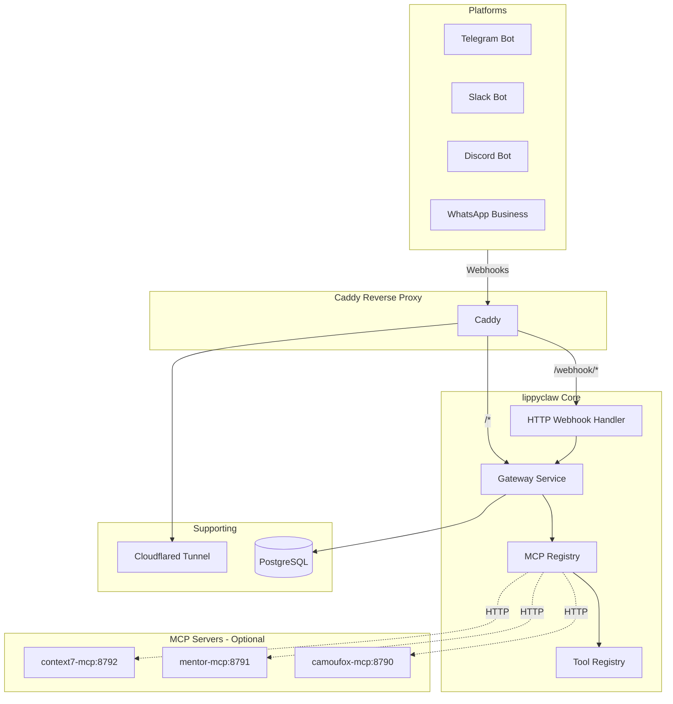
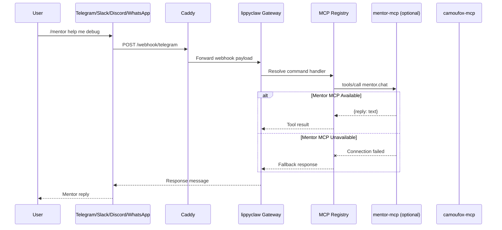
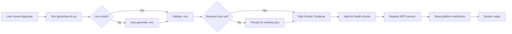
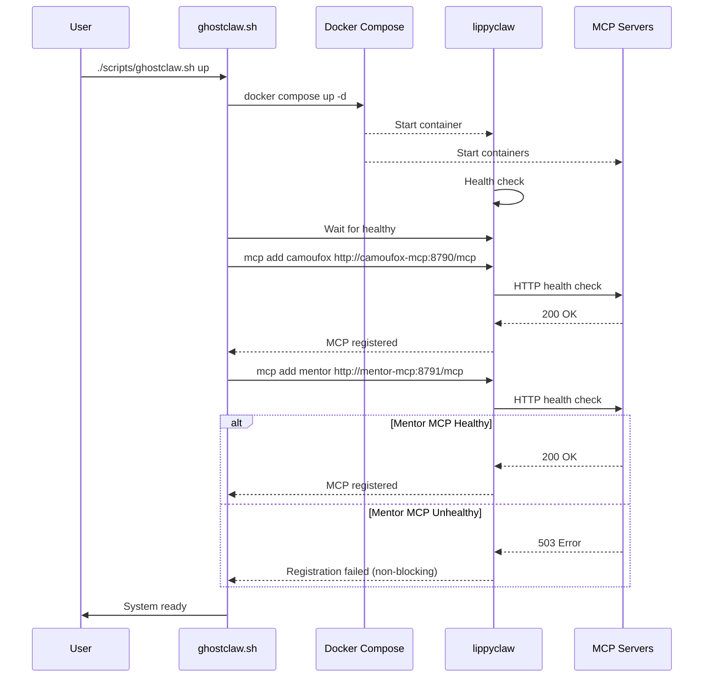
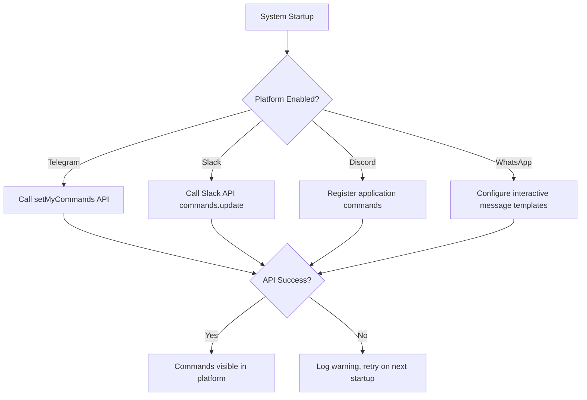

# Ghostclaw Unified Architecture

## Overview

This document addresses the user's requirements for a true one-click deployment system with decoupled mentor integration and unified slash command architecture across all platforms (Telegram, Slack, Discord, WhatsApp).

---

## 1. Current Issues Identified

### 1.1 Two-Command Workflow Problem

**Current State:**
```bash
./scripts/ghostclaw.sh init
./scripts/ghostclaw.sh onboard
./scripts/ghostclaw.sh up
```

**Problem:** The system requires multiple sequential commands. The `onboard` step is interactive and blocks automated deployment.

**Root Cause:** IronClaw's official onboarding wizard was designed for first-time interactive setup, not automated deployments.

### 1.2 Mentor Not Properly Decoupled

**Current State in [`docker-compose.yml`](docker-compose.yml:59-96):**
```yaml
mentor-mcp:
  build:
    context: .
    dockerfile: docker/Dockerfile.mentor-mcp
  # ... configuration ...
  healthcheck:
    test: ["CMD-SHELL", "node -e \"fetch('http://127.0.0.1:8791/healthz')...\""]
  # ...

ironclaw:
  depends_on:
    mentor-mcp:
      condition: service_healthy  # ← BLOCKS if mentor-mcp fails
```

**Problem:** The `depends_on: service_healthy` creates a hard dependency. If mentor-mcp crashes or fails health checks, IronClaw won't start.

**Root Cause:** Docker Compose `depends_on` with `condition: service_healthy` creates a blocking dependency.

### 1.3 Telegram Commands Not Coming Through

**Current State in [`scripts/ghostclaw.sh`](scripts/ghostclaw.sh:584-619):**
```bash
set_telegram_bot_commands() {
  # Uses curl to call Telegram Bot API setMyCommands
  curl -X POST "https://api.telegram.org/bot${bot_token}/setMyCommands" ...
}
```

**Problem:** Commands registered via `setMyCommands` may not appear if:
1. Webhook secret token mismatch
2. Bot was recently changed from inline to group mode
3. Telegram cache hasn't refreshed (user needs to restart Telegram app)
4. Webhook URL not properly set before commands

**Root Cause Analysis:**
- The `setMyCommands` call happens AFTER `setWebhook` in the [`up`](scripts/ghostclaw.sh:1196-1242) command flow
- If webhook setup fails silently, commands may not register properly
- No retry logic for rate-limited Telegram API calls

### 1.4 Lippyclaw Fork Integration

**Current State in [`.env.example`](.env.example:48-49):**
```bash
IRONCLAW_GIT_URL=https://github.com/nearai/ironclaw
IRONCLAW_GIT_REF=v0.12.0
```

**Required Change:** Point to lippyclaw fork:
```bash
IRONCLAW_GIT_URL=https://github.com/lippycoin/lippyclaw
IRONCLAW_GIT_REF=main  # or specific commit/tag
```

---

## 2. Proposed Architecture

### 2.1 System Architecture Diagram



### 2.2 Slash Command Flow



### 2.3 Key Architectural Principles

1. **MCP Servers are Optional:** All MCP servers (mentor, camoufox, context7) should be non-blocking dependencies
2. **UI-Driven Configuration:** All settings controlled via environment variables, no interactive onboarding
3. **Unified Command Pattern:** Same `/command` syntax works across all platforms
4. **Graceful Degradation:** If mentor-mcp crashes, IronClaw continues with reduced functionality

---

## 3. Implementation Changes Needed

### 3.1 Docker Compose - Remove Blocking Dependencies

**File: [`docker-compose.yml`](docker-compose.yml:98-143)**

**Current:**
```yaml
ironclaw:
  depends_on:
    postgres:
      condition: service_healthy
    camoufox-tool:
      condition: service_healthy
    camoufox-mcp:
      condition: service_healthy
    mentor-mcp:
      condition: service_healthy  # ← BLOCKING
```

**Proposed:**
```yaml
ironclaw:
  depends_on:
    postgres:
      condition: service_healthy
    camoufox-tool:
      condition: service_healthy
    # camoufox-mcp and mentor-mcp are OPTIONAL - registered at runtime
```

**Rationale:** MCP servers should be registered dynamically via IronClaw's MCP registry commands, not as Docker dependencies. This allows:
- IronClaw to start even if mentor-mcp fails
- Hot-swap MCP servers without restarting IronClaw
- True optionality - users can disable mentor entirely

### 3.2 Ghostclaw Script - True One-Click Deployment

**File: [`scripts/ghostclaw.sh`](scripts/ghostclaw.sh:1196-1242)**

**Current `up` command flow:**
```bash
up)
  ensure_env_file
  validate_env
  ensure_ironclaw_home_writable
  auto_bootstrap_mentor_voice_if_enabled
  compose_local up -d
  smoke_local
  ensure_camoufox_mcp_registered
  ensure_mentor_mcp_registered
  set_telegram_webhook
  set_telegram_bot_commands
```

**Proposed `up` command (one-click):**
```bash
up)
  # Single entry point - everything automatic
  ensure_env_file          # Auto-generate .env if missing
  validate_env             # Fail fast on required vars
  ensure_data_directories  # Create ./data, ./mentor dirs
  ensure_ironclaw_home_writable
  compose_local up -d      # Start all services
  smoke_local              # Wait for health checks
  register_mcp_servers     # Non-blocking registration
  setup_platform_integrations  # Webhooks + commands
```

**New `register_mcp_servers` function:**
```bash
register_mcp_servers() {
  # Register camoufox-mcp (if enabled)
  if [[ "$(read_env_var MCP_CAMOUFOX_ENABLED)" != "false" ]]; then
    compose_local exec -T ironclaw mcp add camoufox http://camoufox-mcp:8790/mcp || true
  fi
  
  # Register mentor-mcp (if enabled) - NON-BLOCKING
  if [[ "$(read_env_var MCP_MENTOR_ENABLED)" != "false" ]]; then
    compose_local exec -T ironclaw mcp add mentor http://mentor-mcp:8791/mcp || true
  fi
  
  # Restart ironclaw to pick up new MCP servers
  compose_local restart ironclaw || true
}
```

### 3.3 Environment Variable Configuration

**New environment variables for UI-driven control:**

```bash
# MCP Server Control
MCP_CAMOUFOX_ENABLED=true      # Enable/disable camoufox-mcp
MCP_MENTOR_ENABLED=true        # Enable/disable mentor-mcp
MCP_CONTEXT7_ENABLED=false     # Enable/disable context7-mcp

# Platform Integration Control
PLATFORM_TELEGRAM_ENABLED=true
PLATFORM_SLACK_ENABLED=false
PLATFORM_DISCORD_ENABLED=false
PLATFORM_WHATSAPP_ENABLED=false

# Lippyclaw Fork Configuration
IRONCLAW_GIT_URL=https://github.com/lippycoin/lippyclaw
IRONCLAW_GIT_REF=main
```

### 3.4 Unified Slash Command Registration

**Current:** Commands only registered for Telegram via [`set_telegram_bot_commands`](scripts/ghostclaw.sh:584)

**Proposed:** Unified command registration for all platforms

```bash
setup_platform_integrations() {
  if [[ "$(read_env_var PLATFORM_TELEGRAM_ENABLED)" == "true" ]]; then
    setup_telegram_integration
  fi
  
  if [[ "$(read_env_var PLATFORM_SLACK_ENABLED)" == "true" ]]; then
    setup_slack_integration
  fi
  
  # ... other platforms
}

setup_telegram_integration() {
  if telegram_configured; then
    set_telegram_webhook "local"
    set_telegram_bot_commands
  fi
}

# New: Unified command definition
get_unified_commands() {
  cat <<'COMMANDS'
[
  {"command": "help", "description": "Show command list"},
  {"command": "mentor", "description": "Chat with mentor"},
  {"command": "mentor_voice", "description": "Mentor reply with voice"},
  {"command": "run", "description": "Queue browser run"},
  {"command": "job", "description": "Check job status"},
  {"command": "status", "description": "System health status"}
]
COMMANDS
}
```

### 3.5 Lippyclaw Fork Modifications

**Required changes to lippyclaw fork:**

1. **Remove interactive onboarding requirement:**
   - Add `--no-onboard` flag support (already present in [`docker-compose.yml`](docker-compose.yml:106))
   - Ensure all configuration can be done via environment variables

2. **Add MCP server auto-discovery:**
   - On startup, scan for available MCP servers
   - Auto-register based on `MCP_*_ENABLED` environment variables

3. **Unified platform webhook handler:**
   - Single endpoint pattern: `/webhook/{platform}`
   - Consistent payload normalization across platforms

---

## 4. Configuration Flow

### 4.1 User Configuration Flow



### 4.2 Environment Variable Priority

1. **User-set in `.env`** - Highest priority
2. **Auto-generated defaults** - Used if not user-set
3. **Docker Compose defaults** - Fallback values

### 4.3 MCP Server Registration Flow



### 4.4 Slash Command Auto-Population



---

## 5. File Changes Summary

| File | Change Type | Description |
|------|-------------|-------------|
| [`docker-compose.yml`](docker-compose.yml) | Modify | Remove `depends_on` for mentor-mcp and camoufox-mcp |
| [`scripts/ghostclaw.sh`](scripts/ghostclaw.sh) | Modify | Consolidate to true one-click `up` command |
| [`.env.example`](.env.example) | Modify | Add new `MCP_*_ENABLED` and `PLATFORM_*_ENABLED` vars |
| `docker/Dockerfile.ironclaw` | Modify | Ensure `--no-onboard` is default behavior |
| `src/config.ts` | Modify | Add new configuration options for platforms |

---

## 6. Testing Checklist

- [ ] `./scripts/ghostclaw.sh up` starts everything without manual intervention
- [ ] Mentor-mcp crash doesn't prevent IronClaw from starting
- [ ] Camoufox-mcp crash doesn't prevent IronClaw from starting
- [ ] `/mentor` command works in Telegram after startup
- [ ] Commands auto-populate without running separate command
- [ ] Lippyclaw fork builds and runs correctly
- [ ] All environment variables can be set via UI/.env only

---

## 7. Migration Path

For existing deployments:

```bash
# 1. Update .env with new variables
echo "MCP_MENTOR_ENABLED=true" >> .env
echo "MCP_CAMOUFOX_ENABLED=true" >> .env
echo "IRONCLAW_GIT_URL=https://github.com/lippycoin/lippyclaw" >> .env

# 2. Pull latest changes
git pull origin main

# 3. One-click redeploy
./scripts/ghostclaw.sh restart
```
