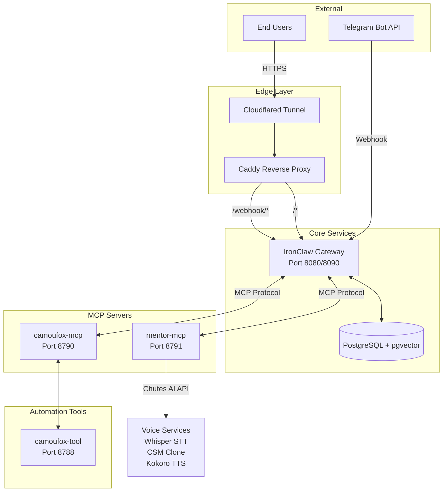
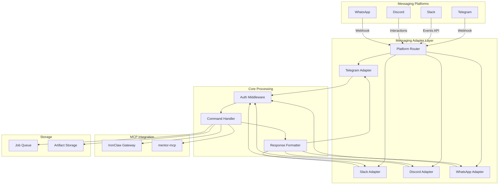
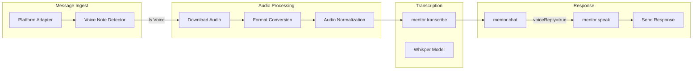
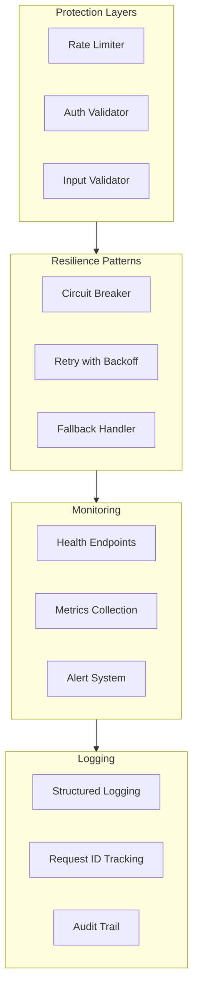

# Ironclaw/Ghostclaw Multi-Platform Slash Command Implementation Plan

**Document Version:** 1.0  
**Date:** 2026-03-02  
**Author:** Architecture Team

---

## Executive Summary

This document provides a comprehensive technical architecture and implementation plan for extending the Ghostclaw/Ironclaw system's slash command support from Telegram-only to a multi-platform solution including Slack, Discord, and WhatsApp. The plan follows the existing decoupled MCP architecture patterns and includes TTS/STT integration recommendations for the mentor-mcp voice features.

---

## 1. Current State Summary

### 1.1 System Architecture Overview

The Ghostclaw system operates with a decoupled microservices architecture:



### 1.2 Current Slash Command Support

| Platform | Status | Commands Available | Implementation Location |
|----------|--------|-------------------|------------------------|
| **Telegram** | ✅ Fully Implemented | `/help`, `/health`, `/mentor`, `/mentor_voice`, `/run`, `/job` | [`src/index.ts`](src/index.ts:177-253), [`scripts/ghostclaw.sh`](scripts/ghostclaw.sh:584-619) |
| **Slack** | ❌ Not Implemented | N/A | N/A |
| **Discord** | ❌ Not Implemented | N/A | N/A |
| **WhatsApp** | ❌ Not Implemented | N/A | N/A |

### 1.3 Telegram Implementation Details

**Webhook Flow:**
- Cloudflared tunnel discovers public URL from logs ([`scripts/ghostclaw.sh:806-821`](scripts/ghostclaw.sh:806-821))
- Webhook registered via `setWebhook` API call ([`scripts/ghostclaw.sh:867-889`](scripts/ghostclaw.sh:867-889))
- Commands registered via `setMyCommands` API call ([`scripts/ghostclaw.sh:599-618`](scripts/ghostclaw.sh:599-618))
- Webhook secret validated via `X-Telegram-Bot-Api-Secret-Token` header ([`src/index.ts:141-144`](src/index.ts:141-144))

**Command Handlers:** ([`src/index.ts:177-253`](src/index.ts:177-253))
- `/start`, `/help` - Show available commands
- `/health` - API health status
- `/run <url>` - Queue browser automation job
- `/job <jobId>` - Check job status
- `/mentor` - Forwarded to IronClaw MCP (handled by mentor-mcp)
- `/mentor_voice` - Forwarded to IronClaw MCP with voice reply

**Configuration:** (`.env.example`)
```bash
ENABLE_TELEGRAM=true
TELEGRAM_BOT_TOKEN=<bot_token>
TELEGRAM_WEBHOOK_SECRET=<secret>
TELEGRAM_WEBHOOK_PATH=/webhook/telegram
TELEGRAM_ALLOWED_CHAT_IDS=<comma_separated_ids>
```

### 1.4 Mentor-MCP TTS/STT Capabilities

**Available Tools:** ([`mentor-mcp/server.mjs:90-152`](mentor-mcp/server.mjs:90-152))

| Tool | Description | Input/Output |
|------|-------------|--------------|
| `mentor.chat` | Chat with mentor persona | `{message, sessionId, voiceReply}` → `{sessionId, reply, voiceArtifact, voiceBackend}` |
| `mentor.speak` | Text-to-speech conversion | `{text}` → `{voiceArtifact, voiceBackend}` |
| `mentor.transcribe` | Speech-to-text transcription | `{base64Audio, mimeType, language}` → `{text}` |
| `mentor.voice_bootstrap` | Initialize voice context | `{}` → `{transcript, contextPath, samplePath}` |
| `mentor.status` | Runtime status check | `{}` → `{llm, voice, memory, personaLoaded}` |

**Voice Pipeline:** ([`mentor-mcp/server.mjs:340-600`](mentor-mcp/server.mjs:340-600))
1. **STT:** Whisper (openai/whisper-large-v3-turbo) via Chutes AI
2. **Voice Clone:** CSM (sesame/csm-1b) with context from master voice sample
3. **Fallback TTS:** Kokoro (hexgrad/Kokoro-82M) when CSM fails

**Configuration:**
```bash
ENABLE_MENTOR_VOICE=true
MENTOR_AUTO_BOOTSTRAP_VOICE=true
MENTOR_VOICE_API_KEY=<chutes_api_key>
MENTOR_CHUTES_RUN_ENDPOINT=https://llm.chutes.ai/v1/run
MENTOR_CHUTES_WHISPER_MODEL=openai/whisper-large-v3-turbo
MENTOR_CHUTES_CSM_MODEL=sesame/csm-1b
MENTOR_CHUTES_KOKORO_MODEL=hexgrad/Kokoro-82M
MENTOR_VOICE_SAMPLE_SOURCE_PATH=./mentor/master-voice.wav
```

---

## 2. Gap Analysis

### 2.1 Platform Integration Gaps

#### 2.1.1 Slack Integration

| Component | Gap | Complexity |
|-----------|-----|------------|
| **Bot Registration** | No Slack app/bot created | Low |
| **Slash Commands** | No `/mentor`, `/mentor_voice`, `/run`, `/job` commands | Medium |
| **Event Handling** | No webhook/event subscription handling | Medium |
| **Message Parsing** | No Slack block kit/message format handling | Low |
| **Authentication** | No signing secret verification | Low |
| **Voice Notes** | No audio file download/transcription | Medium |

**Slack-Specific Requirements:**
- Slack App with Bot scope (`commands`, `chat:write`, `files:read`)
- Request signing verification (X-Slack-Request-Timestamp, X-Slack-Signature)
- Slash command response URL handling
- File upload API for voice artifacts

#### 2.1.2 Discord Integration

| Component | Gap | Complexity |
|-----------|-----|------------|
| **Bot Registration** | No Discord application/bot created | Low |
| **Slash Commands** | No application commands registered | Medium |
| **Interaction Handling** | No interaction endpoint for slash commands | Medium |
| **Message Parsing** | No Discord embed/message format handling | Low |
| **Authentication** | No interaction token verification | Medium |
| **Voice Notes** | No attachment download/transcription | Medium |

**Discord-Specific Requirements:**
- Discord Application with Bot scope (`applications.commands`, `send_messages`, `attach_files`)
- Application Command registration (global or guild-specific)
- Interaction endpoint with cryptographic verification
- File attachment handling for voice messages

#### 2.1.3 WhatsApp Integration

| Component | Gap | Complexity |
|-----------|-----|------------|
| **Business API** | No WhatsApp Business Platform integration | High |
| **Message Templates** | No interactive message templates | Medium |
| **Webhook Handling** | No WhatsApp webhook verification | Medium |
| **Message Parsing** | No WhatsApp message format handling | Medium |
| **Authentication** | No verify token or signature validation | Low |
| **Voice Notes** | No voice message media download | High |

**WhatsApp-Specific Requirements:**
- WhatsApp Business Platform account (Meta Developer)
- Phone number ID and Business Account ID
- Webhook verify token configuration
- Media API for voice message download
- Message template approval for proactive messages

### 2.2 Code Architecture Gaps

| Area | Current State | Required State |
|------|---------------|----------------|
| **Message Abstraction** | Telegram-specific handlers in [`src/index.ts`](src/index.ts:136-175) | Unified message adapter interface |
| **Webhook Routing** | Single `/webhook/telegram` endpoint | Platform-aware routing `/webhook/{platform}` |
| **Command Registry** | Hardcoded in [`scripts/ghostclaw.sh`](scripts/ghostclaw.sh:593) | Dynamic command registry per platform |
| **Response Formatting** | Plain text only | Platform-specific formatting (blocks, embeds) |
| **File Handling** | No file upload abstraction | Unified file upload interface |
| **Authentication** | Telegram secret token only | Platform-specific auth (signing, tokens) |

### 2.3 TTS/STT Integration Gaps

| Gap | Impact | Priority |
|-----|--------|----------|
| **Voice Note Detection** | Cannot auto-detect voice messages on new platforms | High |
| **Audio Format Conversion** | Platforms use different audio formats (OGG, MP4, WAV) | High |
| **File Download Pipeline** | No abstraction for platform-specific file retrieval | High |
| **Voice Reply Delivery** | No unified method to send audio back | Medium |
| **Context Preservation** | Voice context tied to file paths | Low |

---

## 3. Recommended Architecture for Multi-Platform Slash Commands

### 3.1 High-Level Architecture



### 3.2 Adapter Pattern Design

**Base Adapter Interface:**

```typescript
// src/adapters/types.ts
export interface MessageAdapter {
  platform: MessagingPlatform;
  
  // Authentication
  verifyRequest(request: IncomingRequest): Promise<boolean>;
  
  // Message parsing
  parseMessage(rawPayload: unknown): Promise<ParsedMessage>;
  
  // Command handling
  registerCommands(commands: PlatformCommand[]): Promise<void>;
  
  // Response sending
  sendTextMessage(chatId: string, text: string, options?: MessageOptions): Promise<void>;
  sendVoiceMessage(chatId: string, audioPath: string, options?: MessageOptions): Promise<void>;
  sendFileMessage(chatId: string, filePath: string, options?: MessageOptions): Promise<void>;
  
  // File handling
  downloadAttachment(attachmentId: string): Promise<Buffer>;
}

export interface ParsedMessage {
  platform: MessagingPlatform;
  chatId: string;
  userId: string;
  text?: string;
  isVoiceNote: boolean;
  attachmentId?: string;
  attachmentMimeType?: string;
  timestamp: number;
}

export interface PlatformCommand {
  name: string;
  description: string;
  handler: CommandHandler;
}
```

### 3.3 Directory Structure

```
src/
├── adapters/
│   ├── types.ts                    # Shared interfaces
│   ├── base-adapter.ts             # Abstract base class
│   ├── telegram-adapter.ts         # Existing Telegram logic refactored
│   ├── slack-adapter.ts            # New Slack implementation
│   ├── discord-adapter.ts          # New Discord implementation
│   └── whatsapp-adapter.ts         # New WhatsApp implementation
├── messaging/
│   ├── router.ts                   # Platform routing logic
│   ├── auth-middleware.ts          # Unified authentication
│   ├── command-registry.ts         # Command registration manager
│   └── response-formatter.ts       # Platform-specific formatting
├── voice/
│   ├── audio-processor.ts          # Audio format conversion
│   ├── voice-note-detector.ts      # Voice message detection
│   └── file-downloader.ts          # Platform file download
├── lib/
│   ├── telegram.ts                 # Existing (to be refactored)
│   ├── slack.ts                    # New Slack utilities
│   ├── discord.ts                  # New Discord utilities
│   └── whatsapp.ts                 # New WhatsApp utilities
```

### 3.4 Platform-Specific Implementation Details

#### 3.4.1 Slack Adapter

```typescript
// src/adapters/slack-adapter.ts
export class SlackAdapter implements MessageAdapter {
  platform = 'slack' as const;
  
  async verifyRequest(request: IncomingRequest): Promise<boolean> {
    // Verify X-Slack-Request-Timestamp and X-Slack-Signature
    const timestamp = request.headers['x-slack-request-timestamp'];
    const signature = request.headers['x-slack-signature'];
    return verifySlackSignature(timestamp, signature, request.body);
  }
  
  async parseMessage(rawPayload: unknown): Promise<ParsedMessage> {
    // Handle both slash commands and events API messages
    if (isSlashCommand(rawPayload)) {
      return {
        platform: 'slack',
        chatId: rawPayload.channel_id,
        userId: rawPayload.user_id,
        text: rawPayload.text,
        isVoiceNote: false,
        timestamp: Date.now() / 1000,
      };
    }
    // Handle voice notes in files
    if (hasVoiceAttachment(rawPayload)) {
      return {
        platform: 'slack',
        chatId: rawPayload.channel,
        userId: rawPayload.user,
        isVoiceNote: true,
        attachmentId: rawPayload.files[0].id,
        attachmentMimeType: rawPayload.files[0].mimetype,
        timestamp: rawPayload.event_ts,
      };
    }
  }
  
  async sendVoiceMessage(chatId: string, audioPath: string): Promise<void> {
    // Upload file to Slack and send to channel
    const formData = new FormData();
    formData.append('channels', chatId);
    formData.append('file', createReadStream(audioPath));
    await slackClient.files.uploadV2(formData);
  }
}
```

**Slack Configuration:**
```bash
SLACK_BOT_TOKEN=xoxb-...
SLACK_APP_TOKEN=xapp-...
SLACK_SIGNING_SECRET=...
SLACK_ENABLED=false
```

#### 3.4.2 Discord Adapter

```typescript
// src/adapters/discord-adapter.ts
export class DiscordAdapter implements MessageAdapter {
  platform = 'discord' as const;
  
  async verifyRequest(request: IncomingRequest): Promise<boolean> {
    // Verify Discord interaction signature
    const signature = request.headers['x-signature-ed25519'];
    const timestamp = request.headers['x-signature-timestamp'];
    return verifyDiscordSignature(timestamp, signature, request.rawBody);
  }
  
  async parseMessage(rawPayload: unknown): Promise<ParsedMessage> {
    // Handle slash command interactions
    if (isInteraction(rawPayload)) {
      return {
        platform: 'discord',
        chatId: rawPayload.channel_id,
        userId: rawPayload.user.id,
        text: rawPayload.data.options?.find(o => o.name === 'text')?.value,
        isVoiceNote: false,
        timestamp: rawPayload.id,
      };
    }
    // Handle voice messages (attachments)
    if (hasVoiceAttachment(rawPayload)) {
      return {
        platform: 'discord',
        chatId: rawPayload.channel_id,
        userId: rawPayload.author.id,
        isVoiceNote: true,
        attachmentId: rawPayload.attachments[0].url,
        attachmentMimeType: rawPayload.attachments[0].content_type,
        timestamp: Date.parse(rawPayload.timestamp) / 1000,
      };
    }
  }
  
  async registerCommands(commands: PlatformCommand[]): Promise<void> {
    // Register application commands with Discord API
    const rest = new REST({ version: '10' }).setToken(DISCORD_TOKEN);
    await rest.put(
      Routes.applicationCommands(DISCORD_CLIENT_ID),
      { body: commands.map(toDiscordCommand) }
    );
  }
}
```

**Discord Configuration:**
```bash
DISCORD_BOT_TOKEN=...
DISCORD_CLIENT_ID=...
DISCORD_PUBLIC_KEY=...
DISCORD_ENABLED=false
```

#### 3.4.3 WhatsApp Adapter

```typescript
// src/adapters/whatsapp-adapter.ts
export class WhatsAppAdapter implements MessageAdapter {
  platform = 'whatsapp' as const;
  
  async verifyRequest(request: IncomingRequest): Promise<boolean> {
    // Verify webhook challenge or signature
    if (request.query['hub.verify_token']) {
      return request.query['hub.verify_token'] === WHATSAPP_VERIFY_TOKEN;
    }
    return verifyWhatsAppSignature(request.headers, request.body);
  }
  
  async parseMessage(rawPayload: unknown): Promise<ParsedMessage> {
    const message = rawPayload.entry[0].changes[0].value.messages[0];
    
    if (message.type === 'text') {
      return {
        platform: 'whatsapp',
        chatId: message.from,
        userId: message.from,
        text: message.text.body,
        isVoiceNote: false,
        timestamp: message.timestamp,
      };
    }
    
    if (message.type === 'audio') {
      return {
        platform: 'whatsapp',
        chatId: message.from,
        userId: message.from,
        isVoiceNote: true,
        attachmentId: message.audio.id,
        attachmentMimeType: 'audio/ogg; codecs=opus',
        timestamp: message.timestamp,
      };
    }
  }
  
  async downloadAttachment(attachmentId: string): Promise<Buffer> {
    // Get media URL from WhatsApp Media API
    const mediaInfo = await whatsappClient.getMediaUrl(attachmentId);
    const response = await fetch(mediaInfo.url, {
      headers: { 'Authorization': `Bearer ${WHATSAPP_TOKEN}` }
    });
    return Buffer.from(await response.arrayBuffer());
  }
}
```

**WhatsApp Configuration:**
```bash
WHATSAPP_TOKEN=...
WHATSAPP_PHONE_NUMBER_ID=...
WHATSAPP_BUSINESS_ACCOUNT_ID=...
WHATSAPP_VERIFY_TOKEN=...
WHATSAPP_ENABLED=false
```

### 3.5 Unified Command Registry

```typescript
// src/messaging/command-registry.ts
export class CommandRegistry {
  private commands: Map<string, PlatformCommand[]> = new Map();
  
  register(platform: MessagingPlatform, command: PlatformCommand): void {
    const platformCommands = this.commands.get(platform) || [];
    platformCommands.push(command);
    this.commands.set(platform, platformCommands);
  }
  
  async syncAllPlatforms(adapters: Map<MessagingPlatform, MessageAdapter>): Promise<void> {
    for (const [platform, adapter] of adapters) {
      const commands = this.commands.get(platform) || [];
      await adapter.registerCommands(commands);
    }
  }
}

// Command definitions
const GLOBAL_COMMANDS: Omit<PlatformCommand, 'handler'>[] = [
  { name: 'mentor', description: 'Chat with the mentor' },
  { name: 'mentor_voice', description: 'Chat with mentor using voice reply' },
  { name: 'run', description: 'Queue a browser automation job' },
  { name: 'job', description: 'Check job status' },
  { name: 'health', description: 'Check system health' },
];
```

---

## 4. TTS/STT Integration Recommendations

### 4.1 Voice Note Processing Pipeline



### 4.2 Audio Format Handling

| Platform | Native Format | Target Format | Conversion Required |
|----------|---------------|---------------|---------------------|
| Telegram | OGG (Opus) | WAV/MP3 | Yes |
| Slack | MP3, MP4, WAV | WAV/MP3 | Sometimes |
| Discord | MP3, WAV, OGG | WAV/MP3 | Sometimes |
| WhatsApp | OGG (Opus) | WAV/MP3 | Yes |

**Audio Processor Implementation:**

```typescript
// src/voice/audio-processor.ts
import { spawn } from 'child_process';

export class AudioProcessor {
  async convertToWav(inputBuffer: Buffer, inputMimeType: string): Promise<Buffer> {
    const tempInput = `/tmp/audio-input-${Date.now()}`;
    const tempOutput = `/tmp/audio-output-${Date.now()}.wav`;
    
    await writeFile(tempInput, inputBuffer);
    
    return new Promise((resolve, reject) => {
      const ffmpeg = spawn('ffmpeg', [
        '-i', tempInput,
        '-ar', '16000',
        '-ac', '1',
        '-f', 'wav',
        tempOutput,
      ]);
      
      ffmpeg.on('close', async (code) => {
        if (code === 0) {
          const output = await readFile(tempOutput);
          await unlink(tempInput);
          await unlink(tempOutput);
          resolve(output);
        } else {
          reject(new Error(`ffmpeg conversion failed with code ${code}`));
        }
      });
    });
  }
  
  async detectVoiceNote(message: ParsedMessage): Promise<boolean> {
    // Platform-specific detection
    switch (message.platform) {
      case 'telegram':
        return message.text?.startsWith('/mentor_voice') || 
               message.isVoiceNote === true;
      case 'slack':
        return message.isVoiceNote === true ||
               message.text?.includes('voice_message');
      case 'discord':
        return message.isVoiceNote === true;
      case 'whatsapp':
        return message.isVoiceNote === true;
      default:
        return false;
    }
  }
}
```

### 4.3 Mentor-MCP Voice Integration

**Enhanced Voice Flow:**

```typescript
// src/messaging/voice-handler.ts
export class VoiceHandler {
  constructor(
    private mentorMcpUrl: string,
    private audioProcessor: AudioProcessor,
  ) {}
  
  async processVoiceNote(
    adapter: MessageAdapter,
    message: ParsedMessage,
  ): Promise<string> {
    // 1. Download audio from platform
    const audioBuffer = await adapter.downloadAttachment(message.attachmentId!);
    
    // 2. Convert to format compatible with Whisper
    const wavBuffer = await this.audioProcessor.convertToWav(
      audioBuffer,
      message.attachmentMimeType!,
    );
    
    // 3. Transcribe via mentor-mcp
    const base64Audio = wavBuffer.toString('base64');
    const transcription = await this.callMentorTranscribe(base64Audio, 'audio/wav');
    
    // 4. Process transcription through mentor chat
    const chatResponse = await this.callMentorChat(transcription.text, message.chatId);
    
    return chatResponse.reply;
  }
  
  async sendVoiceReply(
    adapter: MessageAdapter,
    chatId: string,
    text: string,
  ): Promise<void> {
    // 1. Generate speech via mentor-mcp
    const speakResult = await this.callMentorSpeak(text);
    
    // 2. Send voice message back to user
    await adapter.sendVoiceMessage(chatId, speakResult.voiceArtifact);
  }
  
  private async callMentorTranscribe(
    base64Audio: string,
    mimeType: string,
  ): Promise<{ text: string }> {
    const response = await fetch(`${this.mentorMcpUrl}/mcp`, {
      method: 'POST',
      headers: { 'Content-Type': 'application/json' },
      body: JSON.stringify({
        jsonrpc: '2.0',
        id: 1,
        method: 'tools/call',
        params: {
          name: 'mentor.transcribe',
          arguments: { base64Audio, mimeType },
        },
      }),
    });
    const result = await response.json();
    return JSON.parse(result.result.content[0].text);
  }
  
  private async callMentorSpeak(text: string): Promise<{ voiceArtifact: string }> {
    const response = await fetch(`${this.mentorMcpUrl}/mcp`, {
      method: 'POST',
      headers: { 'Content-Type': 'application/json' },
      body: JSON.stringify({
        jsonrpc: '2.0',
        id: 2,
        method: 'tools/call',
        params: {
          name: 'mentor.speak',
          arguments: { text },
        },
      }),
    });
    const result = await response.json();
    return JSON.parse(result.result.content[0].text);
  }
}
```

### 4.4 Configuration Recommendations

```bash
# Voice Processing Configuration
ENABLE_MENTOR_VOICE=true
MENTOR_AUTO_BOOTSTRAP_VOICE=true

# Chutes AI Configuration
MENTOR_VOICE_API_KEY=<your_chutes_api_key>
MENTOR_CHUTES_RUN_ENDPOINT=https://llm.chutes.ai/v1/run
MENTOR_CHUTES_WHISPER_MODEL=openai/whisper-large-v3-turbo
MENTOR_CHUTES_CSM_MODEL=sesame/csm-1b
MENTOR_CHUTES_KOKORO_MODEL=hexgrad/Kokoro-82M
MENTOR_CHUTES_ENABLE_KOKORO_FALLBACK=true

# Voice Sample Configuration
MENTOR_VOICE_SAMPLE_SOURCE_PATH=./mentor/master-voice.wav
MENTOR_VOICE_SAMPLE_PATH=/data/mentor/master-voice.wav
MENTOR_VOICE_CONTEXT_PATH=/data/mentor/voice_context.txt
MENTOR_VOICE_AUTO_TRANSCRIBE=true

# Audio Processing Configuration
AUDIO_PROCESSOR_FFMPEG_PATH=/usr/bin/ffmpeg
AUDIO_OUTPUT_FORMAT=wav
AUDIO_SAMPLE_RATE=16000
AUDIO_CHANNELS=1
```

---

## 5. Implementation Phases

### Phase 1: Foundation & Refactoring (Week 1-2)

**Goal:** Establish the adapter pattern foundation and refactor existing Telegram code.

| Task | Description | Files | Priority |
|------|-------------|-------|----------|
| 1.1 | Create adapter type definitions | [`src/adapters/types.ts`](src/adapters/types.ts) | P0 |
| 1.2 | Create base adapter abstract class | [`src/adapters/base-adapter.ts`](src/adapters/base-adapter.ts) | P0 |
| 1.3 | Refactor Telegram handler into adapter | [`src/adapters/telegram-adapter.ts`](src/adapters/telegram-adapter.ts) | P0 |
| 1.4 | Create platform router | [`src/messaging/router.ts`](src/messaging/router.ts) | P0 |
| 1.5 | Create command registry | [`src/messaging/command-registry.ts`](src/messaging/command-registry.ts) | P1 |
| 1.6 | Update webhook routing in index.ts | [`src/index.ts`](src/index.ts) | P0 |

**Deliverables:**
- Working adapter pattern with Telegram implementation
- Unified webhook routing at `/webhook/:platform`
- Command registry for managing platform commands

### Phase 2: Slack Integration (Week 3-4)

**Goal:** Implement full Slack support with slash commands and voice notes.

| Task | Description | Files | Priority |
|------|-------------|-------|----------|
| 2.1 | Create Slack adapter | [`src/adapters/slack-adapter.ts`](src/adapters/slack-adapter.ts) | P0 |
| 2.2 | Implement Slack signing verification | [`src/lib/slack.ts`](src/lib/slack.ts) | P0 |
| 2.3 | Create Slack slash command definitions | [`src/messaging/command-registry.ts`](src/messaging/command-registry.ts) | P0 |
| 2.4 | Implement Slack file upload for voice | [`src/adapters/slack-adapter.ts`](src/adapters/slack-adapter.ts) | P1 |
| 2.5 | Add Slack configuration to .env | [`.env.example`](.env.example) | P0 |
| 2.6 | Create Slack app setup script | [`scripts/setup-slack.sh`](scripts/setup-slack.sh) | P1 |
| 2.7 | Add Slack to docker-compose | [`docker-compose.yml`](docker-compose.yml) | P2 |

**Deliverables:**
- Slack bot with `/mentor`, `/mentor_voice`, `/run`, `/job` commands
- Voice note transcription support
- Voice reply capability

### Phase 3: Discord Integration (Week 5-6)

**Goal:** Implement full Discord support with application commands and attachments.

| Task | Description | Files | Priority |
|------|-------------|-------|----------|
| 3.1 | Create Discord adapter | [`src/adapters/discord-adapter.ts`](src/adapters/discord-adapter.ts) | P0 |
| 3.2 | Implement Discord interaction verification | [`src/lib/discord.ts`](src/lib/discord.ts) | P0 |
| 3.3 | Create Discord application command registration | [`src/adapters/discord-adapter.ts`](src/adapters/discord-adapter.ts) | P0 |
| 3.4 | Implement Discord attachment handling | [`src/adapters/discord-adapter.ts`](src/adapters/discord-adapter.ts) | P1 |
| 3.5 | Add Discord configuration to .env | [`.env.example`](.env.example) | P0 |
| 3.6 | Create Discord bot setup script | [`scripts/setup-discord.sh`](scripts/setup-discord.sh) | P1 |

**Deliverables:**
- Discord bot with slash commands
- Attachment-based voice message support
- Embed-formatted responses

### Phase 4: WhatsApp Integration (Week 7-8)

**Goal:** Implement WhatsApp Business Platform integration.

| Task | Description | Files | Priority |
|------|-------------|-------|----------|
| 4.1 | Create WhatsApp adapter | [`src/adapters/whatsapp-adapter.ts`](src/adapters/whatsapp-adapter.ts) | P0 |
| 4.2 | Implement WhatsApp webhook verification | [`src/lib/whatsapp.ts`](src/lib/whatsapp.ts) | P0 |
| 4.3 | Implement WhatsApp Media API integration | [`src/adapters/whatsapp-adapter.ts`](src/adapters/whatsapp-adapter.ts) | P0 |
| 4.4 | Add WhatsApp configuration to .env | [`.env.example`](.env.example) | P0 |
| 4.5 | Create WhatsApp Business setup guide | [`docs/whatsapp-setup.md`](docs/whatsapp-setup.md) | P1 |

**Deliverables:**
- WhatsApp Business Platform integration
- Voice message transcription
- Text and voice responses

### Phase 5: Voice Processing Pipeline (Week 9-10)

**Goal:** Implement unified voice note processing across all platforms.

| Task | Description | Files | Priority |
|------|-------------|-------|----------|
| 5.1 | Create audio processor with ffmpeg | [`src/voice/audio-processor.ts`](src/voice/audio-processor.ts) | P0 |
| 5.2 | Create voice note detector | [`src/voice/voice-note-detector.ts`](src/voice/voice-note-detector.ts) | P0 |
| 5.3 | Create file downloader abstraction | [`src/voice/file-downloader.ts`](src/voice/file-downloader.ts) | P0 |
| 5.4 | Integrate with mentor-mcp TTS/STT | [`src/messaging/voice-handler.ts`](src/messaging/voice-handler.ts) | P0 |
| 5.5 | Add ffmpeg to Dockerfile | [`docker/Dockerfile.ironclaw`](docker/Dockerfile.ironclaw) | P0 |
| 5.6 | Test voice pipeline across platforms | Integration tests | P1 |

**Deliverables:**
- Unified voice note processing pipeline
- Cross-platform audio format conversion
- Integrated mentor-mcp voice features

### Phase 6: Testing & Documentation (Week 11-12)

**Goal:** Comprehensive testing and documentation.

| Task | Description | Files | Priority |
|------|-------------|-------|----------|
| 6.1 | Write unit tests for adapters | `src/adapters/*.test.ts` | P0 |
| 6.2 | Write integration tests | `tests/integration/` | P0 |
| 6.3 | Create platform setup documentation | `docs/platforms/` | P0 |
| 6.4 | Update README with multi-platform info | [`README.md`](README.md) | P0 |
| 6.5 | Create deployment scripts | [`scripts/deploy-*.sh`](scripts/) | P1 |
| 6.6 | Performance testing | Load tests | P1 |

**Deliverables:**
- Test coverage for all adapters
- Complete documentation
- Deployment automation

---

## 6. Risk Assessment and Mitigation Strategies

### 6.1 Technical Risks

| Risk | Likelihood | Impact | Mitigation |
|------|------------|--------|------------|
| **API Rate Limiting** | High | Medium | Implement request queuing, exponential backoff, and platform-specific rate limit handling |
| **Audio Format Incompatibility** | Medium | High | Use ffmpeg for universal format conversion; test with real voice notes from each platform |
| **Webhook Delivery Failures** | Medium | High | Implement webhook acknowledgment patterns; add retry logic; use platform-specific delivery guarantees |
| **MCP Server Connection Issues** | Low | High | Add circuit breaker pattern; implement MCP connection health checks; fallback to text-only responses |
| **Voice Cloning Quality** | Medium | Medium | Test CSM model thoroughly; ensure Kokoro fallback works; document voice sample requirements |
| **Platform API Changes** | Medium | Medium | Abstract platform APIs behind adapter interface; monitor platform changelogs; version adapter implementations |

### 6.2 Security Risks

| Risk | Likelihood | Impact | Mitigation |
|------|------------|--------|------------|
| **Webhook Spoofing** | Medium | High | Implement strict signature verification for all platforms; validate secret tokens; use HTTPS only |
| **Credential Leakage** | Low | High | Store all tokens in environment variables; never log credentials; use secret management for VPS |
| **Unauthorized Command Execution** | Medium | High | Implement chat/user allowlists per platform; validate user permissions; log all command executions |
| **File Upload Vulnerabilities** | Medium | Medium | Validate file types before processing; scan uploaded files; limit file sizes |
| **Voice Data Privacy** | Low | High | Document voice data handling; implement data retention policies; allow users to opt-out of voice features |

### 6.3 Operational Risks

| Risk | Likelihood | Impact | Mitigation |
|------|------------|--------|------------|
| **Increased Resource Usage** | High | Medium | Monitor memory/CPU usage; scale horizontally; implement job queuing with BullMQ |
| **Platform Dependency** | Medium | Medium | Design for graceful degradation; if one platform fails, others continue working |
| **Complex Debugging** | High | Low | Implement structured logging with request IDs; create platform-specific log filters; add health endpoints |
| **Deployment Complexity** | Medium | Medium | Use docker-compose for local; create VPS deployment scripts; document rollback procedures |

### 6.4 Risk Mitigation Architecture



---

## 7. Appendix

### 7.1 Environment Variables Reference

```bash
# Core Configuration
NODE_ENV=production
LOG_LEVEL=info

# Platform Enable Flags
ENABLE_TELEGRAM=true
ENABLE_SLACK=false
ENABLE_DISCORD=false
ENABLE_WHATSAPP=false

# Telegram Configuration
TELEGRAM_BOT_TOKEN=
TELEGRAM_WEBHOOK_SECRET=
TELEGRAM_WEBHOOK_PATH=/webhook/telegram
TELEGRAM_ALLOWED_CHAT_IDS=

# Slack Configuration
SLACK_BOT_TOKEN=
SLACK_APP_TOKEN=
SLACK_SIGNING_SECRET=
SLACK_ENABLED=false

# Discord Configuration
DISCORD_BOT_TOKEN=
DISCORD_CLIENT_ID=
DISCORD_PUBLIC_KEY=
DISCORD_ENABLED=false

# WhatsApp Configuration
WHATSAPP_TOKEN=
WHATSAPP_PHONE_NUMBER_ID=
WHATSAPP_BUSINESS_ACCOUNT_ID=
WHATSAPP_VERIFY_TOKEN=
WHATSAPP_ENABLED=false

# Voice Configuration
ENABLE_MENTOR_VOICE=true
MENTOR_AUTO_BOOTSTRAP_VOICE=true
MENTOR_VOICE_API_KEY=
MENTOR_CHUTES_RUN_ENDPOINT=https://llm.chutes.ai/v1/run
MENTOR_CHUTES_WHISPER_MODEL=openai/whisper-large-v3-turbo
MENTOR_CHUTES_CSM_MODEL=sesame/csm-1b
MENTOR_CHUTES_KOKORO_MODEL=hexgrad/Kokoro-82M
MENTOR_CHUTES_ENABLE_KOKORO_FALLBACK=true
MENTOR_VOICE_SAMPLE_SOURCE_PATH=./mentor/master-voice.wav
MENTOR_VOICE_SAMPLE_PATH=/data/mentor/master-voice.wav
MENTOR_VOICE_CONTEXT_PATH=/data/mentor/voice_context.txt
MENTOR_VOICE_AUTO_TRANSCRIBE=true

# Audio Processing
AUDIO_PROCESSOR_FFMPEG_PATH=/usr/bin/ffmpeg
AUDIO_OUTPUT_FORMAT=wav
AUDIO_SAMPLE_RATE=16000
AUDIO_CHANNELS=1
```

### 7.2 Command Reference

| Command | Description | Parameters | Platforms |
|---------|-------------|------------|-----------|
| `/mentor` | Chat with mentor | Optional: text message | All |
| `/mentor_voice` | Chat with voice reply | Optional: text message | All |
| `/run` | Queue browser job | URL | All |
| `/job` | Check job status | jobId | All |
| `/health` | System health check | None | All |

### 7.3 File References

| File | Purpose |
|------|---------|
| [`src/index.ts`](src/index.ts) | Main entry point, webhook routing |
| [`src/adapters/types.ts`](src/adapters/types.ts) | Shared adapter interfaces |
| [`mentor-mcp/server.mjs`](mentor-mcp/server.mjs) | Mentor MCP server with TTS/STT |
| [`scripts/ghostclaw.sh`](scripts/ghostclaw.sh) | Deployment and management script |
| [`docker-compose.yml`](docker-compose.yml) | Service orchestration |

---

## 8. Approval

This implementation plan requires review and approval before proceeding to the Code mode for implementation.

**Review Checklist:**
- [ ] Architecture aligns with existing Ghostclaw patterns
- [ ] All platform integrations are covered
- [ ] TTS/STT pipeline is properly designed
- [ ] Risk mitigations are adequate
- [ ] Implementation phases are realistic
- [ ] Documentation is complete

**Approved by:** _________________  
**Date:** _________________
