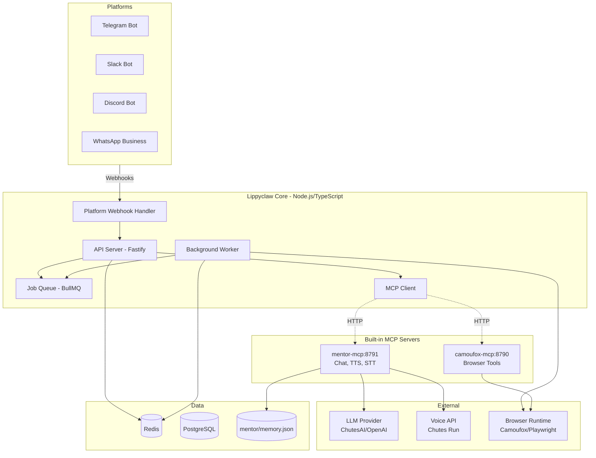
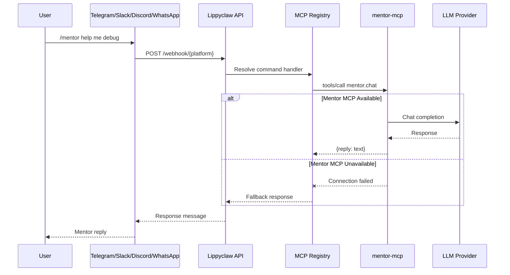
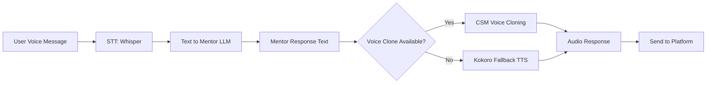
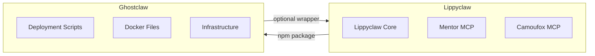

# Lippyclaw Standalone Architecture

## Executive Summary

**Lippyclaw** is a self-contained, ready-to-run AI automation platform that includes mentor and voice capabilities out of the box. When someone clones the repository, they should have everything needed to run immediately without dependencies on external deployment wrappers.

**Ghostclaw** is a SEPARATE, generic AI deployment template that can optionally wrap lippyclaw for production containerized deployments.

---

## 1. Product Boundaries

### 1.1 Lippyclaw (The Product)

```
lippyclaw/
├── src/                      # Core TypeScript application
│   ├── index.ts              # Main API server (Telegram, Slack, Discord, WhatsApp webhooks)
│   ├── worker.ts             # Background job processor
│   ├── config.ts             # Configuration with platform integrations
│   ├── types.ts              # TypeScript types
│   ├── schemas.ts            # Zod validation schemas
│   ├── errors.ts             # Error handling
│   ├── logger.ts             # Logging utilities
│   ├── lib/
│   │   ├── telegram.ts       # Telegram bot client
│   │   ├── slack.ts          # Slack bot client (NEW)
│   │   ├── discord.ts        # Discord bot client (NEW)
│   │   ├── whatsapp.ts       # WhatsApp Business client (NEW)
│   │   ├── queue.ts          # BullMQ queue management
│   │   └── openai-compatible.ts  # LLM client
│   └── automation/
│       ├── run-browser-job.ts    # Browser automation logic
│       └── challenge-detector.ts # CAPTCHA/challenge detection
├── mentor-mcp/               # Built-in Mentor MCP server
│   ├── package.json
│   └── server.mjs            # Mentor chat, TTS, STT tools
├── camoufox-mcp/             # Built-in Camoufox MCP server
│   ├── package.json
│   └── server.mjs            # Browser automation tools
├── mentor/                   # Mentor configuration
│   └── persona.md            # Mentor personality definition
├── docker/                   # Optional Docker support
│   ├── Dockerfile.lippyclaw      # Main app container
│   ├── Dockerfile.mentor-mcp     # Mentor MCP container
│   ├── Dockerfile.camoufox-mcp   # Camoufox MCP container
│   └── ironclaw-entrypoint.sh    # Ironclaw runtime entrypoint
├── docker-compose.yml        # Full stack (optional)
├── docker-compose.local.yml  # Local development overrides
├── package.json              # Node.js dependencies
├── tsconfig.json             # TypeScript configuration
├── .env.example              # Environment variable template
└── README.md                 # Quick start guide
```

**Key Characteristics:**
- Runs natively with `npm install && npm run dev` (no Docker required)
- Mentor TTS/STT capabilities built-in via `mentor-mcp/`
- Multi-platform slash commands (Telegram, Slack, Discord, WhatsApp)
- Optional Docker for production deployment
- Can optionally pull Ironclaw fork at runtime or use built-in automation

### 1.2 Ghostclaw (The Deployment Wrapper)

```
ghostclaw/                    # Generic AI deployment template
├── scripts/
│   └── ghostclaw.sh          # Orchestration script
├── docker/
│   ├── Dockerfile.ironclaw   # Builds Ironclaw/lippyclaw from source
│   └── ...                   # Other service Dockerfiles
├── docker-compose.yml        # Production compose config
├── infra/
│   └── Caddyfile             # Reverse proxy config
└── README.md                 # Deployment guide
```

**Key Characteristics:**
- Generic template for deploying any AI service
- Handles Docker builds, volume management, reverse proxy
- Can wrap lippyclaw OR any other AI service
- NOT required to run lippyclaw

---

## 2. Lippyclaw Architecture

### 2.1 System Architecture Diagram



### 2.2 Slash Command Flow



### 2.3 Voice Processing Pipeline



---

## 3. Running Lippyclaw

### 3.1 Quick Start (Native/Bare-Metal)

```bash
# 1. Clone the repository
git clone https://github.com/lippycoin/lippyclaw
cd lippyclaw

# 2. Install dependencies
npm install

# 3. Copy environment template
cp .env.example .env

# 4. Edit .env with your API keys
# Required: MAIN_LLM_API_KEY, SUB_LLM_API_KEY
# Optional: TELEGRAM_BOT_TOKEN (for Telegram integration)

# 5. Start Redis (required for job queue)
# macOS: brew install redis && brew services start redis
# Linux: sudo systemctl start redis
# Docker: docker run -d -p 6379:6379 redis:7

# 6. Run in development mode
npm run dev           # Main API server
npm run dev:worker    # Background worker (separate terminal)

# 7. (Optional) Start MCP servers
node mentor-mcp/server.mjs      # Mentor MCP
node camoufox-mcp/server.mjs    # Camoufox MCP
```

### 3.2 Quick Start (Docker - Optional)

```bash
# 1. Clone and configure
git clone https://github.com/lippycoin/lippyclaw
cd lippyclaw
cp .env.example .env
# Edit .env with your API keys

# 2. Start everything
docker compose up -d

# 3. Check health
curl http://localhost:8080/healthz
```

### 3.3 Environment Variables

```bash
# Core runtime
NODE_ENV=development
PORT=8787
REDIS_URL=redis://localhost:6379

# LLM Configuration (Required)
MAIN_LLM_BASE_URL=https://llm.chutes.ai/v1
MAIN_LLM_API_KEY=your_api_key_here
MAIN_LLM_MODEL=Qwen/Qwen3.5-397B-A17B-TEE

SUB_LLM_BASE_URL=https://llm.chutes.ai/v1
SUB_LLM_API_KEY=your_api_key_here
SUB_LLM_MODEL=MiniMaxAI/MiniMax-M2.5-TEE

# Telegram Integration (Optional)
ENABLE_TELEGRAM=true
TELEGRAM_BOT_TOKEN=your_bot_token
TELEGRAM_WEBHOOK_SECRET=your_webhook_secret
TELEGRAM_ALLOWED_CHAT_IDS=123456789

# Mentor Configuration (Optional - enabled by default)
MENTOR_NAME=Lippyclaw Mentor
ENABLE_MENTOR_VOICE=true
MENTOR_LLM_API_KEY=your_api_key_here
MENTOR_VOICE_API_KEY=your_api_key_here

# Platform Integrations (Optional)
PLATFORM_SLACK_ENABLED=false
SLACK_BOT_TOKEN=
SLACK_SIGNING_SECRET=

PLATFORM_DISCORD_ENABLED=false
DISCORD_BOT_TOKEN=
DISCORD_CLIENT_ID=

PLATFORM_WHATSAPP_ENABLED=false
WHATSAPP_PHONE_NUMBER_ID=
WHATSAPP_ACCESS_TOKEN=
```

---

## 4. Platform Integrations

### 4.1 Unified Slash Commands

All platforms support the same slash commands:

| Command | Description |
|---------|-------------|
| `/help` | Show available commands |
| `/mentor <message>` | Chat with mentor |
| `/mentor_voice <message>` | Mentor reply with voice |
| `/run <url>` | Queue browser automation job |
| `/job <jobId>` | Check job status |
| `/status` | System health status |

### 4.2 Platform-Specific Setup

#### Telegram
```bash
# BotFather: create bot, get token
# Set webhook: POST https://api.telegram.org/bot<TOKEN>/setWebhook
# URL: https://your-domain.com/webhook/telegram
```

#### Slack
```bash
# Slack App: create app, enable Bot scope
# Install to workspace, get bot token
# Set interactive component URL: https://your-domain.com/webhook/slack
```

#### Discord
```bash
# Discord Developer Portal: create application
# Create bot, get token
# Invite bot with: applications.commands scope
# Set interaction endpoint: https://your-domain.com/webhook/discord
```

#### WhatsApp
```bash
# Meta for Developers: create WhatsApp Business app
# Get phone number ID and access token
# Set webhook URL: https://your-domain.com/webhook/whatsapp
```

---

## 5. MCP Server Integration

### 5.1 Built-in MCP Servers

Lippyclaw ships with two MCP servers:

#### Mentor MCP (`mentor-mcp/`)
- `mentor.chat` - Chat with mentor persona
- `mentor.speak` - Convert text to mentor voice
- `mentor.transcribe` - Transcribe audio to text
- `mentor.voice_bootstrap` - Initialize voice cloning context
- `mentor.status` - Check mentor runtime status

#### Camoufox MCP (`camoufox-mcp/`)
- `browser.session_new` - Start browser session
- `browser.session_close` - Close browser session
- `browser.goto` - Navigate to URL
- `browser.click` - Click element
- `browser.fill` - Fill input field
- `browser.press` - Press key on element
- `browser.click_xy` - Click coordinates
- `browser.wait_for_selector` - Wait for element
- `browser.wait` - Wait milliseconds
- `browser.screenshot` - Capture screenshot

### 5.2 MCP Registration

MCP servers are auto-registered at startup:

```typescript
// In src/index.ts
const mcpServers = [
  { name: 'mentor', url: 'http://localhost:8791/mcp' },
  { name: 'camoufox', url: 'http://localhost:8790/mcp' },
];

for (const server of mcpServers) {
  try {
    await registerMcpServer(server.name, server.url);
    logger.info(`MCP server registered: ${server.name}`);
  } catch (error) {
    logger.warn(`MCP server unavailable: ${server.name}`);
    // Non-blocking - continue without this MCP server
  }
}
```

---

## 6. File Structure Details

### 6.1 Core Application Files

#### [`src/index.ts`](src/index.ts:1)
Main API server handling:
- Platform webhook endpoints (`/webhook/telegram`, `/webhook/slack`, etc.)
- Health check endpoint (`/healthz`)
- Job queue API (`/api/v1/jobs`)
- MCP server registration

#### [`src/worker.ts`](src/worker.ts:1)
Background worker processing:
- Browser automation jobs from queue
- LLM agent calls for vision/analysis
- Completion notifications to platforms

#### [`src/config.ts`](src/config.ts:1)
Configuration management:
- Environment variable parsing with Zod validation
- Platform-specific settings
- LLM provider configuration

### 6.2 MCP Server Files

#### [`mentor-mcp/server.mjs`](mentor-mcp/server.mjs:1)
Mentor MCP server:
- Fastify-based HTTP server
- MCP protocol implementation
- Voice cloning pipeline (Whisper → LLM → CSM/Kokoro)
- Session memory persistence

#### [`camoufox-mcp/server.mjs`](camoufox-mcp/server.mjs:1)
Camoufox MCP server:
- Browser automation tool registry
- HTTP client for camoufox-tool service
- Session management

---

## 7. Production Deployment Options

### 7.1 Native Deployment (PM2)

```bash
# Install PM2
npm install -g pm2

# Start services
pm2 start npm --name "lippyclaw-api" -- run start
pm2 start npm --name "lippyclaw-worker" -- run start:worker
pm2 start node --name "mentor-mcp" -- mentor-mcp/server.mjs
pm2 start node --name "camoufox-mcp" -- camoufox-mcp/server.mjs

# Save PM2 configuration
pm2 save
pm2 startup
```

### 7.2 Docker Deployment

```bash
# Build images
docker compose build

# Start services
docker compose up -d

# View logs
docker compose logs -f
```

### 7.3 Railway/Render Deployment

```bash
# Railway
railway login
railway init
railway up

# Set environment variables
railway variables set MAIN_LLM_API_KEY=xxx
```

---

## 8. Migration from Ghostclaw

### 8.1 What Moves to Lippyclaw

| Component | From | To |
|-----------|------|-----|
| Core API (`src/`) | ghostclaw | lippyclaw |
| Mentor MCP | ghostclaw/mentor-mcp | lippyclaw/mentor-mcp |
| Camoufox MCP | ghostclaw/camoufox-mcp | lippyclaw/camoufox-mcp |
| Mentor persona | ghostclaw/mentor | lippyclaw/mentor |
| Platform integrations | ghostclaw/src/lib | lippyclaw/src/lib |

### 8.2 What Stays in Ghostclaw

| Component | Location | Purpose |
|-----------|----------|---------|
| `ghostclaw.sh` | ghostclaw/scripts | Orchestration wrapper |
| Ironclaw Dockerfile | ghostclaw/docker | Build Ironclaw from source |
| Caddy configuration | ghostclaw/infra | Reverse proxy |
| VPS deployment scripts | ghostclaw/scripts | SSH/SCP deployment |

### 8.3 Synchronization Strategy



**Approach:**
1. Lippyclaw is published as an npm package (optional)
2. Ghostclaw can install lippyclaw as a dependency
3. Ghostclaw provides Docker wrapper around lippyclaw package
4. Both repos stay independent - no code duplication

---

## 9. Implementation Checklist

### Phase 1: Core Separation
- [ ] Rename `ghostclaw-template` to `lippyclaw` in package.json
- [ ] Update README.md with lippyclaw branding
- [ ] Add Slack, Discord, WhatsApp integration stubs
- [ ] Document native run instructions

### Phase 2: Platform Integrations
- [ ] Implement `src/lib/slack.ts`
- [ ] Implement `src/lib/discord.ts`
- [ ] Implement `src/lib/whatsapp.ts`
- [ ] Add platform-specific webhook handlers
- [ ] Create unified command registration

### Phase 3: Documentation
- [ ] Create Lippyclaw-specific README
- [ ] Document native installation steps
- [ ] Create platform setup guides
- [ ] Add troubleshooting section

### Phase 4: Ghostclaw Separation
- [ ] Update ghostclaw to use lippyclaw as dependency
- [ ] Remove duplicate code from ghostclaw
- [ ] Document ghostclaw as optional wrapper
- [ ] Create migration guide

---

## 10. API Reference

### Health Check
```
GET /healthz
Response: { status: "ok", service: "lippyclaw-api", ... }
```

### Queue Job
```
POST /api/v1/jobs
Headers: Authorization: Bearer <INTERNAL_API_TOKEN>
Body: { jobName, startUrl, actions, visionPrompt, chatId }
Response: { jobId, status: "queued" }
```

### Get Job Status
```
GET /api/v1/jobs/:jobId
Headers: Authorization: Bearer <INTERNAL_API_TOKEN>
Response: { jobId, state, payload, result }
```

### Platform Webhooks
```
POST /webhook/telegram
POST /webhook/slack
POST /webhook/discord
POST /webhook/whatsapp
```

---

## 11. Troubleshooting

### MCP Server Not Connecting
```bash
# Check if MCP server is running
curl http://localhost:8791/healthz  # Mentor
curl http://localhost:8790/healthz  # Camoufox

# Check logs
node mentor-mcp/server.mjs 2>&1 | tee mentor.log
```

### Redis Connection Failed
```bash
# Start Redis
brew services start redis  # macOS
sudo systemctl start redis  # Linux

# Or use Docker
docker run -d -p 6379:6379 redis:7
```

### Telegram Commands Not Showing
```bash
# Force command registration
curl -X POST "https://api.telegram.org/bot<TOKEN>/setMyCommands" \
  -H "Content-Type: application/json" \
  -d '{"commands":[...]}'
```

### Voice Cloning Not Working
```bash
# Check voice sample exists
ls -la mentor/master-voice.wav

# Bootstrap voice context
curl http://localhost:8791/bootstrap/voice -X POST

# Check context file
cat data/mentor/voice_context.txt
```
