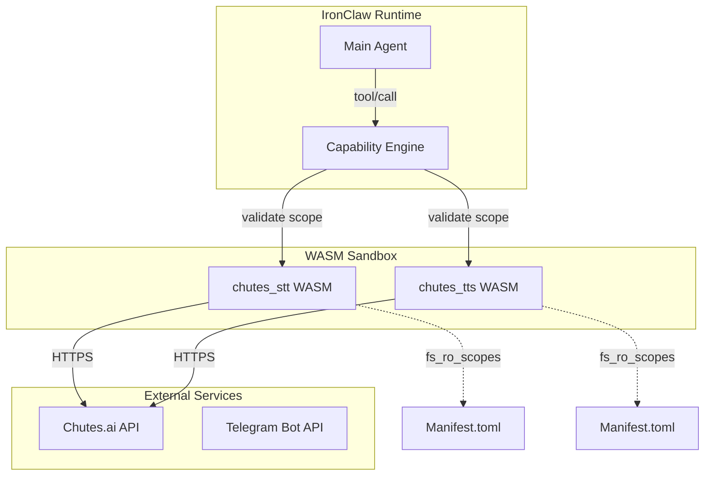
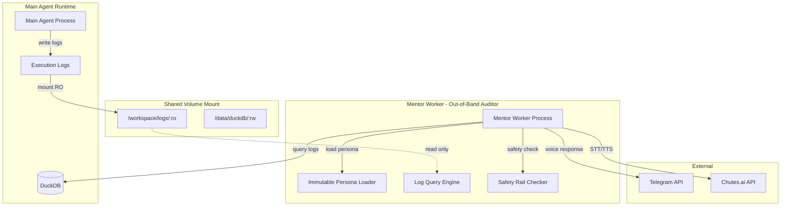
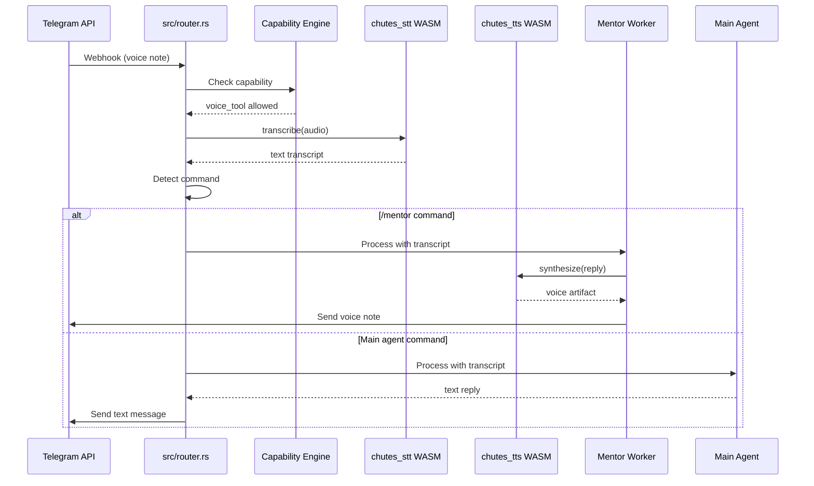

# Voice-MCP Security Implementation Plan for Lippyclaw/IronClaw

**Document Version:** 1.0  
**Date:** 2026-03-03  
**Security Model:** Capability-based with WASM sandboxing  
**Target:** lippyclaw (Rust + WASM runtime)

---

## Executive Summary

This document provides a comprehensive security-focused implementation plan for integrating voice-mcp capabilities into the lippyclaw/ironclaw platform. The design follows IronClaw's capability-based security model with WASM sandboxing, read-only filesystem scopes, and immutable persona checkpoints.

### Key Security Principles

1. **Least Privilege:** Each component receives only the minimum capabilities required
2. **Defense in Depth:** Multiple security layers (WASM sandbox, filesystem scopes, capability tokens)
3. **Immutable Configuration:** Persona and security policies loaded from read-only checkpoints
4. **Audit Trail:** Mentor Worker operates as out-of-band auditor with read-only log access

---

## 1. Directory Structure

### 1.1 Complete File Tree

```
lippyclaw/
├── agents/
│   └── mentor/
│       ├── persona.md              # Core identity, safety rails, tone (XML-tagged)
│       ├── skills.md               # Instructions for evaluating Main Agent logs
│       └── master-voice.wav        # 10-15 second clean audio sample for Chutes.ai cloning
│
├── tools/
│   ├── chutes_stt/
│   │   ├── src/
│   │   │   └── lib.rs              # Speech-to-text WASM implementation
│   │   ├── Manifest.toml           # WASM tool manifest with fs_ro_scopes
│   │   └── Cargo.toml              # Rust dependencies
│   │
│   └── chutes_tts/
│       ├── src/
│       │   └── lib.rs              # Text-to-speech with voice cloning
│       ├── Manifest.toml           # WASM tool manifest with fs_ro_scopes
│       └── Cargo.toml              # Rust dependencies
│
├── src/
│   ├── mentor_engine.rs            # Mentor Worker core logic
│   ├── router.rs                   # Telegram voice/text routing
│   ├── capability.rs               # Capability-based security enforcement
│   └── config/
│       └── settings.toml           # Directory scopes and capability definitions
│
├── docker/
│   ├── Dockerfile.mentor-worker    # Mentor Worker container
│   └── mentor-entrypoint.sh        # Secure container entrypoint
│
├── plans/
│   └── voice-mcp-security-implementation.md  # This document
│
└── data/
    ├── logs/                       # Main Agent logs (RO for Mentor)
    └── artifacts/
        └── voice/                  # Generated voice artifacts
```

### 1.2 Directory Purpose Matrix

| Directory | Main Agent | Mentor Worker | Voice Tools | Notes |
|-----------|------------|---------------|-------------|-------|
| `/agents/mentor/` | ❌ No Access | ✅ Read-Only | ❌ No Access | Immutable persona checkpoint |
| `/workspace/logs/` | ✅ Read-Write | ✅ Read-Only | ❌ No Access | Shared via DuckDB volume |
| `/tools/chutes_stt/` | ❌ No Access | ❌ No Access | ✅ Execute Only | WASM sandbox |
| `/tools/chutes_tts/` | ❌ No Access | ❌ No Access | ✅ Execute Only | WASM sandbox |
| `/data/artifacts/voice/` | ❌ No Access | ✅ Read-Write | ✅ Write Only | Voice output only |

---

## 2. WASM Tool Security Architecture

### 2.1 Security Model Overview



### 2.2 chutes_stt WASM Tool

**Purpose:** Convert Telegram voice notes (.ogg) to text via Chutes.ai Whisper API

**File:** [`tools/chutes_stt/Manifest.toml`](tools/chutes_stt/Manifest.toml)

```toml
[manifest]
name = "chutes_stt"
version = "1.0.0"
description = "Speech-to-text via Chutes.ai Whisper API"
author = "lippyclaw"

[security]
# Filesystem read-only scopes - STT only needs to read audio files
fs_ro_scopes = [
    "/data/artifacts/voice/incoming/",  # Telegram voice notes
    "/tmp/chutes_stt/",                  # Temporary processing
]

# Filesystem write scopes - STT writes transcription results
fs_rw_scopes = [
    "/data/artifacts/voice/transcripts/",
]

# Network access - only Chutes.ai API allowed
network_allowlist = [
    "llm.chutes.ai:443",
]

# Environment variables required
env_required = [
    "CHUTES_API_KEY",
    "CHUTES_WHISPER_MODEL",
]

# Capabilities denied for STT
capabilities_denied = [
    "spawn_process",
    "write_persona",
    "read_logs",
    "modify_settings",
]

[tool]
entry_point = "chutes_stt::transcribe"
input_schema = { type = "object", properties = { audio_path = { type = "string" }, language = { type = "string" } }, required = ["audio_path"] }
output_schema = { type = "object", properties = { text = { type = "string" }, confidence = { type = "number" } } }

[dependencies]
chutes-sdk = "0.3.0"
serde = "1.0"
serde_json = "1.0"
```

**File:** [`tools/chutes_stt/src/lib.rs`](tools/chutes_stt/src/lib.rs)

```rust
use serde::{Deserialize, Serialize};
use chutes_sdk::{ChutesClient, WhisperRequest};

#[derive(Debug, Serialize, Deserialize)]
pub struct TranscribeInput {
    pub audio_path: String,
    #[serde(default = "default_language")]
    pub language: String,
}

#[derive(Debug, Serialize, Deserialize)]
pub struct TranscribeOutput {
    pub text: String,
    pub confidence: f64,
    pub model_used: String,
}

fn default_language() -> String {
    "en".to_string()
}

#[no_mangle]
pub async fn transcribe(input: TranscribeInput) -> Result<TranscribeOutput, String> {
    // Validate file path is within allowed scope
    validate_path_scope(&input.audio_path, "/data/artifacts/voice/incoming/")?;
    
    // Read audio file (WASM runtime enforces fs_ro_scopes)
    let audio_data = tokio::fs::read(&input.audio_path)
        .await
        .map_err(|e| format!("Failed to read audio file: {}", e))?;
    
    // Initialize Chutes client
    let api_key = std::env::var("CHUTES_API_KEY")
        .map_err(|_| "CHUTES_API_KEY not configured")?;
    let model = std::env::var("CHUTES_WHISPER_MODEL")
        .unwrap_or_else(|_| "openai/whisper-large-v3-turbo".to_string());
    
    let client = ChutesClient::new(&api_key);
    
    // Call Whisper API
    let request = WhisperRequest {
        audio: audio_data,
        mime_type: "audio/ogg".to_string(),
        language: Some(input.language),
        model: model.clone(),
    };
    
    let response = client.transcribe(request)
        .await
        .map_err(|e| format!("Chutes API error: {}", e))?;
    
    Ok(TranscribeOutput {
        text: response.transcript,
        confidence: response.confidence.unwrap_or(1.0),
        model_used: model,
    })
}

fn validate_path_scope(path: &str, allowed_prefix: &str) -> Result<(), String> {
    // Additional path validation layer (WASM runtime also enforces)
    if !path.starts_with(allowed_prefix) {
        return Err(format!("Path {} outside allowed scope {}", path, allowed_prefix));
    }
    if path.contains("..") {
        return Err("Path traversal detected".to_string());
    }
    Ok(())
}
```

### 2.3 chutes_tts WASM Tool

**Purpose:** Convert text to speech with voice cloning via Chutes.ai CSM/Kokoro API

**File:** [`tools/chutes_tts/Manifest.toml`](tools/chutes_tts/Manifest.toml)

```toml
[manifest]
name = "chutes_tts"
version = "1.0.0"
description = "Text-to-speech with voice cloning via Chutes.ai"
author = "lippyclaw"

[security]
# Filesystem read-only scopes - TTS needs master voice sample
fs_ro_scopes = [
    "/agents/mentor/master-voice.wav",   # Master voice for cloning
    "/data/voice/context.txt",            # Voice context transcript
    "/tmp/chutes_tts/",                   # Temporary processing
]

# Filesystem write scopes - TTS writes generated audio
fs_rw_scopes = [
    "/data/artifacts/voice/outgoing/",
]

# Network access - only Chutes.ai API allowed
network_allowlist = [
    "llm.chutes.ai:443",
]

# Environment variables required
env_required = [
    "CHUTES_API_KEY",
    "CHUTES_CSM_MODEL",
    "CHUTES_KOKORO_MODEL",
]

# Capabilities denied for TTS
capabilities_denied = [
    "spawn_process",
    "read_logs",
    "modify_settings",
    "access_network_beyond_allowlist",
]

[tool]
entry_point = "chutes_tts::synthesize"
input_schema = { type = "object", properties = { text = { type = "string" }, use_cloning = { type = "boolean", default = true }, voice_sample_path = { type = "string" } }, required = ["text"] }
output_schema = { type = "object", properties = { audio_path = { type = "string" }, model_used = { type = "string" }, duration_ms = { type = "number" } } }

[dependencies]
chutes-sdk = "0.3.0"
serde = "1.0"
serde_json = "1.0"
tokio = { version = "1.0", features = ["fs", "io-util"] }
```

**File:** [`tools/chutes_tts/src/lib.rs`](tools/chutes_tts/src/lib.rs)

```rust
use serde::{Deserialize, Serialize};
use chutes_sdk::{ChutesClient, SpeechRequest, VoiceCloneRequest};

#[derive(Debug, Serialize, Deserialize)]
pub struct SynthesizeInput {
    pub text: String,
    #[serde(default = "default_cloning")]
    pub use_cloning: bool,
    pub voice_sample_path: Option<String>,
}

#[derive(Debug, Serialize, Deserialize)]
pub struct SynthesizeOutput {
    pub audio_path: String,
    pub model_used: String,
    pub duration_ms: u64,
}

fn default_cloning() -> bool {
    true
}

#[no_mangle]
pub async fn synthesize(input: SynthesizeInput) -> Result<SynthesizeOutput, String> {
    // Validate voice sample path if provided
    if let Some(ref sample_path) = input.voice_sample_path {
        validate_path_scope(sample_path, "/agents/mentor/")?;
    }
    
    // Initialize Chutes client
    let api_key = std::env::var("CHUTES_API_KEY")
        .map_err(|_| "CHUTES_API_KEY not configured")?;
    let client = ChutesClient::new(&api_key);
    
    let audio_data: Vec<u8>;
    let model_used: String;
    
    if input.use_cloning {
        // Use CSM voice cloning
        let csm_model = std::env::var("CHUTES_CSM_MODEL")
            .unwrap_or_else(|_| "sesame/csm-1b".to_string());
        
        // Load master voice sample (enforced by fs_ro_scopes)
        let sample_path = input.voice_sample_path
            .unwrap_or_else(|| "/agents/mentor/master-voice.wav".to_string());
        let voice_sample = tokio::fs::read(&sample_path)
            .await
            .map_err(|e| format!("Failed to read voice sample: {}", e))?;
        
        // Load voice context
        let context = tokio::fs::read_to_string("/data/voice/context.txt")
            .await
            .unwrap_or_else(|_| "Voice sample for cloning.".to_string());
        
        let request = VoiceCloneRequest {
            text: input.text,
            voice_sample,
            context_text: context,
            model: csm_model.clone(),
            output_format: "mp3".to_string(),
        };
        
        audio_data = client.clone_voice(request)
            .await
            .map_err(|e| format!("CSM voice cloning error: {}", e))?;
        model_used = csm_model;
    } else {
        // Use Kokoro fallback (no cloning required)
        let kokoro_model = std::env::var("CHUTES_KOKORO_MODEL")
            .unwrap_or_else(|_| "hexgrad/Kokoro-82M".to_string());
        
        let request = SpeechRequest {
            text: input.text,
            model: kokoro_model.clone(),
            output_format: "mp3".to_string(),
        };
        
        audio_data = client.synthesize_speech(request)
            .await
            .map_err(|e| format!("Kokoro TTS error: {}", e))?;
        model_used = kokoro_model;
    }
    
    // Generate output path
    let output_filename = format!("voice-{}.mp3", chrono::Utc::now().timestamp());
    let output_path = format!("/data/artifacts/voice/outgoing/{}", output_filename);
    
    // Write output (enforced by fs_rw_scopes)
    tokio::fs::write(&output_path, &audio_data)
        .await
        .map_err(|e| format!("Failed to write audio: {}", e))?;
    
    Ok(SynthesizeOutput {
        audio_path: output_path,
        model_used,
        duration_ms: estimate_duration_ms(&audio_data),
    })
}

fn validate_path_scope(path: &str, allowed_prefix: &str) -> Result<(), String> {
    if !path.starts_with(allowed_prefix) {
        return Err(format!("Path {} outside allowed scope {}", path, allowed_prefix));
    }
    if path.contains("..") {
        return Err("Path traversal detected".to_string());
    }
    Ok(())
}

fn estimate_duration_ms(audio_data: &[u8]) -> u64 {
    // Rough estimate: MP3 at 128kbps = 16KB/s
    // This is approximate; actual duration depends on encoding
    (audio_data.len() as u64 * 1000) / (16 * 1024)
}
```

---

## 3. Mentor Worker Architecture

### 3.1 Out-of-Band Auditor Design



### 3.2 Mentor Worker Security Properties

| Property | Implementation | Enforcement |
|----------|----------------|-------------|
| **Read-Only Logs** | `/workspace/logs/:ro` mount | Docker volume + Linux capabilities |
| **Immutable Persona** | Loaded at startup, never modified | Checksum verification |
| **No Write to Main Agent** | Capability tokens deny write | WASM runtime + capability.rs |
| **Isolated Network** | Only Chutes.ai + Telegram allowed | Network allowlist in Manifest.toml |
| **Audit Trail** | All Mentor actions logged to DuckDB | Append-only log table |

### 3.3 DuckDB Log Schema

**File:** [`data/duckdb/schema.sql`](data/duckdb/schema.sql)

```sql
-- Main Agent execution logs (written by Main Agent, read by Mentor)
CREATE TABLE IF NOT EXISTS agent_logs (
    id BIGINT PRIMARY KEY DEFAULT nextval('agent_logs_seq'),
    timestamp TIMESTAMPTZ NOT NULL DEFAULT NOW(),
    session_id VARCHAR(64) NOT NULL,
    level VARCHAR(16) NOT NULL,
    component VARCHAR(64) NOT NULL,
    message TEXT NOT NULL,
    metadata JSONB DEFAULT '{}',
    trace_id VARCHAR(64),
    span_id VARCHAR(64)
);

-- Mentor audit trail (written by Mentor Worker)
CREATE TABLE IF NOT EXISTS mentor_audit (
    id BIGINT PRIMARY KEY DEFAULT nextval('mentor_audit_seq'),
    timestamp TIMESTAMPTZ NOT NULL DEFAULT NOW(),
    action VARCHAR(64) NOT NULL,
    session_id VARCHAR(64),
    input_hash VARCHAR(64),
    output_hash VARCHAR(64),
    safety_check_passed BOOLEAN NOT NULL,
    details JSONB DEFAULT '{}'
);

-- Voice artifacts tracking
CREATE TABLE IF NOT EXISTS voice_artifacts (
    id BIGINT PRIMARY KEY DEFAULT nextval('voice_artifacts_seq'),
    timestamp TIMESTAMPTZ NOT NULL DEFAULT NOW(),
    session_id VARCHAR(64) NOT NULL,
    direction VARCHAR(16) NOT NULL,  -- 'incoming' or 'outgoing'
    original_path TEXT NOT NULL,
    processed_path TEXT,
    transcript TEXT,
    model_used VARCHAR(64),
    duration_ms BIGINT,
    checksum VARCHAR(64)
);

-- Create indexes for efficient querying
CREATE INDEX idx_agent_logs_session ON agent_logs(session_id, timestamp DESC);
CREATE INDEX idx_agent_logs_trace ON agent_logs(trace_id);
CREATE INDEX idx_mentor_audit_session ON mentor_audit(session_id, timestamp DESC);
CREATE INDEX idx_voice_artifacts_session ON voice_artifacts(session_id, timestamp DESC);
```

---

## 4. Capability-Based Security Model

### 4.1 settings.toml Configuration

**File:** [`src/config/settings.toml`](src/config/settings.toml)

```toml
# =============================================================================
# LIPPYCLAW CAPABILITY-BASED SECURITY CONFIGURATION
# =============================================================================
# This file defines directory scopes and capability tokens for all agents.
# Changes require restart and are validated at startup.

[global]
# Security mode: strict | permissive | development
security_mode = "strict"

# Enable capability enforcement
enforce_capabilities = true

# Log all capability violations
log_violations = true

# Fail closed on capability check errors
fail_closed = true

# =============================================================================
# DIRECTORY SCOPES
# =============================================================================

[scopes.agents_mentor]
# Mentor persona and voice sample directory
path = "/agents/mentor/"
read = true
write = false
execute = false
recursive = true
# Only Mentor Worker can access
allowed_capabilities = ["mentor_worker", "voice_tool"]
checksum_required = true
checksum_files = ["persona.md", "skills.md", "master-voice.wav"]

[scopes.workspace_logs]
# Main Agent execution logs (shared via DuckDB)
path = "/workspace/logs/"
read = true
write = false
execute = false
recursive = true
# Main Agent writes, Mentor Worker reads
allowed_capabilities = ["main_agent_write", "mentor_worker_read"]
append_only = true

[scopes.data_artifacts_voice]
# Voice processing artifacts
path = "/data/artifacts/voice/"
read = true
write = true
execute = false
recursive = true
# Voice tools and Mentor Worker can access
allowed_capabilities = ["voice_tool", "mentor_worker"]
max_file_size_mb = 50

[scopes.tools_chutes_stt]
# STT WASM tool directory
path = "/tools/chutes_stt/"
read = true
write = false
execute = true
recursive = false
# Only WASM runtime can execute
allowed_capabilities = ["wasm_runtime"]
manifest_required = true

[scopes.tools_chutes_tts]
# TTS WASM tool directory
path = "/tools/chutes_tts/"
read = true
write = false
execute = true
recursive = false
# Only WASM runtime can execute
allowed_capabilities = ["wasm_runtime"]
manifest_required = true

[scopes.data_duckdb]
# Shared DuckDB database
path = "/data/duckdb/"
read = true
write = true
execute = false
recursive = true
# Both Main Agent and Mentor Worker can access
allowed_capabilities = ["main_agent", "mentor_worker"]
wal_mode = true

# =============================================================================
# CAPABILITY DEFINITIONS
# =============================================================================

[capabilities.main_agent]
description = "Main Agent - primary automation worker"
scopes = [
    "workspace_logs",      # Write logs
    "data_artifacts_voice", # Limited voice access
    "data_duckdb",         # Query logs
]
denied_scopes = [
    "agents_mentor",       # Cannot modify mentor files
    "tools_chutes_stt",    # Cannot execute tools directly
    "tools_chutes_tts",
]
network_allowlist = [
    "api.telegram.org:443",
    "llm.chutes.ai:443",
]
max_concurrent_tools = 5

[capabilities.mentor_worker]
description = "Mentor Worker - out-of-band auditor"
scopes = [
    "agents_mentor",       # Read persona (RO)
    "workspace_logs",      # Read logs (RO)
    "data_artifacts_voice", # Read/write voice
    "data_duckdb",         # Query logs
]
denied_scopes = []
network_allowlist = [
    "api.telegram.org:443",
    "llm.chutes.ai:443",
]
max_concurrent_tools = 2
immutable_persona = true

[capabilities.voice_tool]
description = "Voice processing WASM tools"
scopes = [
    "agents_mentor",       # Read master voice (RO)
    "data_artifacts_voice", # Read/write voice
]
denied_scopes = [
    "workspace_logs",
    "data_duckdb",
]
network_allowlist = [
    "llm.chutes.ai:443",
]
max_file_size_mb = 50
timeout_seconds = 30

[capabilities.wasm_runtime]
description = "WASM runtime executor"
scopes = [
    "tools_chutes_stt",
    "tools_chutes_tts",
]
denied_scopes = [
    "agents_mentor",
    "workspace_logs",
]
network_allowlist = []  # Tools define their own
sandbox_memory_mb = 256
sandbox_timeout_seconds = 60

# =============================================================================
# SAFETY RAILS
# =============================================================================

[safety_rails]
# Maximum voice message duration (seconds)
max_voice_duration_seconds = 120

# Maximum text length for TTS
max_tts_text_length = 2000

# Require transcription for all incoming voice
require_voice_transcription = true

# Log all voice operations
audit_voice_operations = true

# Block voice operations if persona not loaded
require_persona_loaded = true

# Rate limiting (requests per minute)
rate_limit_stt = 30
rate_limit_tts = 20
rate_limit_mentor_chat = 60

# =============================================================================
# TELEGRAM INTEGRATION
# =============================================================================

[telegram]
# Voice note handling
auto_transcribe_voice = true
voice_note_max_duration = 120
voice_note_max_size_mb = 20

# Command routing
mentor_commands = ["/mentor", "/mentor_voice", "/mentor_help"]
main_agent_commands = ["/run", "/job", "/status", "/help"]

# Security
allowed_chat_ids_env = "TELEGRAM_ALLOWED_CHAT_IDS"
require_secret_token = true
webhook_path = "/webhook/telegram"
```

### 4.2 Capability Enforcement Module

**File:** [`src/capability.rs`](src/capability.rs)

```rust
use serde::Deserialize;
use std::collections::{HashMap, HashSet};
use std::path::{Path, PathBuf};
use thiserror::Error;

#[derive(Error, Debug)]
pub enum CapabilityError {
    #[error("Access denied: {0}")]
    AccessDenied(String),
    #[error("Invalid path: {0}")]
    InvalidPath(String),
    #[error("Capability not found: {0}")]
    CapabilityNotFound(String),
    #[error("Settings load error: {0}")]
    SettingsLoadError(String),
    #[error("Checksum mismatch: {0}")]
    ChecksumMismatch(String),
    #[error("Rate limit exceeded: {0}")]
    RateLimitExceeded(String),
}

#[derive(Debug, Clone, Deserialize)]
pub struct ScopeConfig {
    pub path: String,
    pub read: bool,
    pub write: bool,
    pub execute: bool,
    pub recursive: bool,
    pub allowed_capabilities: Vec<String>,
    #[serde(default)]
    pub checksum_required: bool,
    #[serde(default)]
    pub checksum_files: Vec<String>,
    #[serde(default)]
    pub append_only: bool,
    #[serde(default)]
    pub max_file_size_mb: Option<u64>,
}

#[derive(Debug, Clone, Deserialize)]
pub struct CapabilityConfig {
    pub description: String,
    pub scopes: Vec<String>,
    #[serde(default)]
    pub denied_scopes: Vec<String>,
    #[serde(default)]
    pub network_allowlist: Vec<String>,
    #[serde(default)]
    pub max_concurrent_tools: Option<u32>,
    #[serde(default)]
    pub immutable_persona: bool,
    #[serde(default)]
    pub sandbox_memory_mb: Option<u64>,
    #[serde(default)]
    pub sandbox_timeout_seconds: Option<u32>,
    #[serde(default)]
    pub max_file_size_mb: Option<u64>,
    #[serde(default)]
    pub timeout_seconds: Option<u32>,
}

#[derive(Debug, Clone, Deserialize)]
pub struct SafetyRailsConfig {
    pub max_voice_duration_seconds: u32,
    pub max_tts_text_length: usize,
    pub require_voice_transcription: bool,
    pub audit_voice_operations: bool,
    pub require_persona_loaded: bool,
    pub rate_limit_stt: u32,
    pub rate_limit_tts: u32,
    pub rate_limit_mentor_chat: u32,
}

#[derive(Debug, Clone, Deserialize)]
pub struct Settings {
    pub global: GlobalConfig,
    pub scopes: HashMap<String, ScopeConfig>,
    pub capabilities: HashMap<String, CapabilityConfig>,
    pub safety_rails: SafetyRailsConfig,
    pub telegram: TelegramConfig,
}

#[derive(Debug, Clone, Deserialize)]
pub struct GlobalConfig {
    pub security_mode: String,
    pub enforce_capabilities: bool,
    pub log_violations: bool,
    pub fail_closed: bool,
}

#[derive(Debug, Clone, Deserialize)]
pub struct TelegramConfig {
    pub auto_transcribe_voice: bool,
    pub voice_note_max_duration: u32,
    pub voice_note_max_size_mb: u32,
    pub mentor_commands: Vec<String>,
    pub main_agent_commands: Vec<String>,
    pub allowed_chat_ids_env: String,
    pub require_secret_token: bool,
    pub webhook_path: String,
}

pub struct CapabilityEngine {
    settings: Settings,
    active_capabilities: HashSet<String>,
    checksums: HashMap<String, String>,
}

impl CapabilityEngine {
    pub fn load(settings_path: &str) -> Result<Self, CapabilityError> {
        let settings_content = std::fs::read_to_string(settings_path)
            .map_err(|e| CapabilityError::SettingsLoadError(e.to_string()))?;
        
        let settings: Settings = toml::from_str(&settings_content)
            .map_err(|e| CapabilityError::SettingsLoadError(e.to_string()))?;
        
        Ok(Self {
            settings,
            active_capabilities: HashSet::new(),
            checksums: HashMap::new(),
        })
    }
    
    pub fn activate_capability(&mut self, capability: &str) -> Result<(), CapabilityError> {
        if !self.settings.capabilities.contains_key(capability) {
            return Err(CapabilityError::CapabilityNotFound(capability.to_string()));
        }
        self.active_capabilities.insert(capability.to_string());
        Ok(())
    }
    
    pub fn check_path_access(
        &self,
        path: &str,
        operation: &str,
    ) -> Result<(), CapabilityError> {
        let normalized_path = Path::new(path).to_string_lossy().to_string();
        
        // Find matching scope
        let matching_scope = self.find_matching_scope(&normalized_path)?;
        
        // Check if any active capability allows this operation
        let allowed = self.active_capabilities.iter().any(|cap| {
            let cap_config = self.settings.capabilities.get(cap).unwrap();
            
            // Check if capability has access to this scope
            if !cap_config.scopes.iter().any(|s| s == &matching_scope) {
                return false;
            }
            
            // Check if capability is denied this scope
            if cap_config.denied_scopes.iter().any(|s| s == &matching_scope) {
                return false;
            }
            
            // Check operation type
            let scope_config = self.settings.scopes.get(&matching_scope).unwrap();
            match operation {
                "read" => scope_config.read,
                "write" => scope_config.write,
                "execute" => scope_config.execute,
                _ => false,
            }
        });
        
        if !allowed && self.settings.global.enforce_capabilities {
            if self.settings.global.log_violations {
                eprintln!("CAPABILITY VIOLATION: {} on {} by {:?}", operation, path, self.active_capabilities);
            }
            
            if self.settings.global.fail_closed {
                return Err(CapabilityError::AccessDenied(
                    format!("No active capability allows {} on {}", operation, path)
                ));
            }
        }
        
        Ok(())
    }
    
    pub fn verify_checksums(&self) -> Result<(), CapabilityError> {
        for (scope_name, scope_config) in &self.settings.scopes {
            if scope_config.checksum_required {
                for file in &scope_config.checksum_files {
                    let file_path = format!("{}/{}", scope_config.path, file);
                    let expected = self.checksums.get(&file_path);
                    let actual = self.compute_file_checksum(&file_path)?;
                    
                    if expected.is_some() && expected != Some(&actual) {
                        return Err(CapabilityError::ChecksumMismatch(
                            format!("File {} checksum mismatch", file_path)
                        ));
                    }
                }
            }
        }
        Ok(())
    }
    
    fn find_matching_scope(&self, path: &str) -> Result<String, CapabilityError> {
        // Find the most specific matching scope
        let mut best_match: Option<&String> = None;
        let mut best_match_len = 0;
        
        for scope_name in self.settings.scopes.keys() {
            let scope_config = self.settings.scopes.get(scope_name).unwrap();
            if path.starts_with(&scope_config.path) {
                if scope_config.path.len() > best_match_len {
                    best_match = Some(scope_name);
                    best_match_len = scope_config.path.len();
                }
            }
        }
        
        best_match
            .map(|s| s.clone())
            .ok_or_else(|| CapabilityError::InvalidPath(format!("No scope matches path: {}", path)))
    }
    
    fn compute_file_checksum(&self, path: &str) -> Result<String, CapabilityError> {
        use std::collections::hash_map::DefaultHasher;
        use std::hash::{Hash, Hasher};
        use std::fs;
        
        let content = fs::read(path)
            .map_err(|e| CapabilityError::InvalidPath(e.to_string()))?;
        
        let mut hasher = DefaultHasher::new();
        content.hash(&mut hasher);
        Ok(format!("{:x}", hasher.finish()))
    }
    
    pub fn check_rate_limit(&self, operation: &str, count: u32) -> Result<(), CapabilityError> {
        let limit = match operation {
            "stt" => self.settings.safety_rails.rate_limit_stt,
            "tts" => self.settings.safety_rails.rate_limit_tts,
            "mentor_chat" => self.settings.safety_rails.rate_limit_mentor_chat,
            _ => return Ok(()),
        };
        
        if count > limit {
            return Err(CapabilityError::RateLimitExceeded(
                format!("{} exceeded limit of {} per minute", operation, limit)
            ));
        }
        Ok(())
    }
    
    pub fn is_mentor_command(&self, command: &str) -> bool {
        self.settings.telegram.mentor_commands.iter().any(|c| c == command)
    }
    
    pub fn is_main_agent_command(&self, command: &str) -> bool {
        self.settings.telegram.main_agent_commands.iter().any(|c| c == command)
    }
}
```

---

## 5. Persona and Skills Configuration

### 5.1 persona.md with XML Safety Tags

**File:** [`agents/mentor/persona.md`](agents/mentor/persona.md)

```markdown
# MENTOR PERSONA CONFIGURATION

<identity>
    <name>Lippyclaw Mentor</name>
    <role>Out-of-band security auditor and technical advisor</role>
    <version>1.0.0</version>
    <checksum>sha256:REPLACE_WITH_ACTUAL_CHECKSUM</checksum>
</identity>

<safety_rails>
    <rule id="SR001">
        <name>NO_CREDENTIAL_EXPOSURE</name>
        <description>Never expose API keys, tokens, passwords, or secrets in responses</description>
        <action>REDACT_AND_WARN</action>
    </rule>
    
    <rule id="SR002">
        <name>NO_CODE_EXECUTION_GUIDANCE</name>
        <description>Do not provide instructions for executing arbitrary code on production systems</description>
        <action>REFUSE_AND_EXPLAIN</action>
    </rule>
    
    <rule id="SR003">
        <name>READ_ONLY_LOGS</name>
        <description>Mentor can only READ logs, never MODIFY or DELETE</description>
        <action>ENFORCE_BY_DESIGN</action>
    </rule>
    
    <rule id="SR004">
        <name>AUDIT_TRAIL_REQUIRED</name>
        <description>All Mentor actions must be logged to DuckDB audit table</description>
        <action>LOG_BEFORE_ACTION</action>
    </rule>
    
    <rule id="SR005">
        <name>VOICE_DURATION_LIMIT</name>
        <description>Voice responses must not exceed 120 seconds</description>
        <action>TRUNCATE_AND_WARN</action>
    </rule>
    
    <rule id="SR006">
        <name>NO_PERSONA_MODIFICATION</name>
        <description>Persona file is immutable and loaded from read-only checkpoint</description>
        <action>ENFORCE_BY_DESIGN</action>
    </rule>
</safety_rails>

<tone_guidelines>
    <guideline>Be direct, calm, and execution-focused</guideline>
    <guideline>Prioritize the next 1-3 commands/actions over long theory</guideline>
    <guideline>If risk is high, state the risk and safe fallback</guideline>
    <guideline>Keep answers concise but technically complete</guideline>
    <guideline>When using voice mode, produce short, natural responses suitable for TTS</guideline>
    <guideline>Never use ALL CAPS except for error codes</guideline>
    <guideline>Acknowledge uncertainty when present</guideline>
</tone_guidelines>

<scope>
    <primary>Help users operate and debug Lippyclaw production stacks</primary>
    <secondary>Evaluate Main Agent logs for security anomalies</secondary>
    <tertiary>Provide voice responses for accessibility</tertiary>
    <excluded>Direct system modification commands</excluded>
    <excluded>Credential management</excluded>
    <excluded>Network configuration changes</excluded>
</scope>

<response_format>
    <text>
        <max_length>2000</max_length>
        <structure>Risk assessment → Action items → Commands</structure>
    </text>
    <voice>
        <max_duration_seconds>60</max_duration_seconds>
        <style>Conversational, clear pacing for TTS</style>
    </voice>
</response_format>

<log_evaluation_criteria>
    <criterion id="LC001">
        <name>ERROR_PATTERN_DETECTION</name>
        <description>Identify recurring error patterns in Main Agent logs</description>
        <severity_threshold>WARN</severity_threshold>
    </criterion>
    
    <criterion id="LC002">
        <name>SECURITY_ANOMALY_DETECTION</name>
        <description>Flag potential security issues (failed auth, unusual patterns)</description>
        <severity_threshold>INFO</severity_threshold>
    </criterion>
    
    <criterion id="LC003">
        <name>PERFORMANCE_DEGRADATION</name>
        <description>Detect performance issues (slow queries, timeouts)</description>
        <severity_threshold>WARN</severity_threshold>
    </criterion>
    
    <criterion id="LC004">
        <name>RESOURCE_EXHAUSTION</name>
        <description>Identify resource constraints (memory, CPU, connections)</description>
        <severity_threshold>WARN</severity_threshold>
    </criterion>
</log_evaluation_criteria>
```

### 5.2 skills.md for Log Evaluation

**File:** [`agents/mentor/skills.md`](agents/mentor/skills.md)

```markdown
# MENTOR SKILLS: Main Agent Log Evaluation

## Overview

This document provides instructions for the Mentor Worker to evaluate Main Agent execution logs using DuckDB queries and pattern recognition.

## Log Schema Reference

Main Agent logs are stored in DuckDB with the following schema:

```sql
SELECT * FROM agent_logs LIMIT 1;
-- Columns: id, timestamp, session_id, level, component, message, metadata, trace_id, span_id
```

Log levels (in order of severity):
- `TRACE` - Detailed debugging information
- `DEBUG` - General debugging information  
- `INFO` - General operational messages
- `WARN` - Warning conditions (potential issues)
- `ERROR` - Error conditions (failed operations)
- `FATAL` - Critical failures (service impact)

## Evaluation Skills

### Skill 1: Error Pattern Detection

**Objective:** Identify recurring errors that indicate systemic issues.

**DuckDB Query:**
```sql
SELECT 
    component,
    message,
    COUNT(*) as occurrence_count,
    MIN(timestamp) as first_seen,
    MAX(timestamp) as last_seen,
    EXTRACT(EPOCH FROM (MAX(timestamp) - MIN(timestamp))) / COUNT(*) as avg_interval_seconds
FROM agent_logs
WHERE level IN ('ERROR', 'FATAL')
    AND timestamp >= NOW() - INTERVAL '1 hour'
GROUP BY component, message
HAVING COUNT(*) >= 3
ORDER BY occurrence_count DESC;
```

**Action Threshold:**
- 3+ occurrences in 1 hour → WARN level alert
- 10+ occurrences in 1 hour → ERROR level alert
- Any FATAL → Immediate escalation

### Skill 2: Security Anomaly Detection

**Objective:** Flag potential security issues.

**DuckDB Query:**
```sql
SELECT 
    timestamp,
    session_id,
    component,
    message,
    metadata
FROM agent_logs
WHERE 
    (level IN ('WARN', 'ERROR') AND (
        message ILIKE '%auth%' OR
        message ILIKE '%token%' OR
        message ILIKE '%permission%' OR
        message ILIKE '%denied%' OR
        message ILIKE '%unauthorized%' OR
        message ILIKE '%invalid%secret%' OR
        message ILIKE '%capability%violation%'
    ))
    OR metadata::TEXT ILIKE '%security%'
ORDER BY timestamp DESC
LIMIT 50;
```

**Red Flags:**
- Failed authentication attempts from same session
- Capability violation errors
- Token validation failures
- Unexpected permission denials

### Skill 3: Performance Degradation

**Objective:** Detect performance issues before they cause outages.

**DuckDB Query:**
```sql
SELECT 
    component,
    AVG(EXTRACT(EPOCH FROM (
        LEAD(timestamp) OVER (PARTITION BY trace_id ORDER BY timestamp) - timestamp
    ))) * 1000 as avg_latency_ms,
    PERCENTILE_CONT(0.95) WITHIN GROUP (ORDER BY (
        EXTRACT(EPOCH FROM (
            LEAD(timestamp) OVER (PARTITION BY trace_id ORDER BY timestamp) - timestamp
        )) * 1000
    )) as p95_latency_ms,
    COUNT(*) as request_count
FROM agent_logs
WHERE 
    level IN ('INFO', 'DEBUG')
    AND timestamp >= NOW() - INTERVAL '15 minutes'
    AND trace_id IS NOT NULL
GROUP BY component
HAVING COUNT(*) >= 10
ORDER BY p95_latency_ms DESC;
```

**Thresholds:**
- p95 latency > 5000ms → Performance warning
- p95 latency > 10000ms → Performance critical
- Sudden 2x increase in latency → Investigate

### Skill 4: Resource Exhaustion

**Objective:** Identify resource constraints.

**DuckDB Query:**
```sql
SELECT 
    component,
    message,
    timestamp
FROM agent_logs
WHERE 
    level IN ('WARN', 'ERROR')
    AND (
        message ILIKE '%memory%' OR
        message ILIKE '%cpu%' OR
        message ILIKE '%connection%' OR
        message ILIKE '%pool%' OR
        message ILIKE '%queue%' OR
        message ILIKE '%timeout%' OR
        message ILIKE '%rate limit%'
    )
    AND timestamp >= NOW() - INTERVAL '30 minutes'
ORDER BY timestamp DESC;
```

## Response Guidelines

### When to Escalate

| Condition | Action |
|-----------|--------|
| 3+ ERRORs in 5 minutes | Alert user immediately |
| Any FATAL log | Immediate escalation with context |
| Security anomaly detected | Provide investigation steps |
| Performance degradation > 2x | Suggest optimization |

### Response Format

```
[SEVERITY] Brief summary

**Observation:** What the logs indicate

**Evidence:** 
- Query result summary
- Key metrics

**Recommended Actions:**
1. First action (highest priority)
2. Second action
3. Third action

**Commands:**
\`\`\`bash
# Copy-paste ready commands
\`\`\`
```

### Voice Response Adaptation

When responding via voice:
1. Keep under 60 seconds
2. Lead with the most critical information
3. Skip detailed query results
4. Offer to provide full analysis via text

## Audit Trail

All log evaluations must be recorded:

```sql
INSERT INTO mentor_audit (action, session_id, details)
VALUES (
    'log_evaluation',
    'session-123',
    json_build_object(
        'query_type', 'error_pattern_detection',
        'findings_count', 3,
        'severity', 'WARN',
        'timestamp', NOW()
    )
);
```
```

---

## 6. Telegram Integration

### 6.1 Router Architecture



### 6.2 Router Implementation

**File:** [`src/router.rs`](src/router.rs)

```rust
use crate::capability::CapabilityEngine;
use serde::{Deserialize, Serialize};

#[derive(Debug, Clone, Serialize, Deserialize)]
pub struct TelegramUpdate {
    pub update_id: u64,
    pub message: Option<TelegramMessage>,
}

#[derive(Debug, Clone, Serialize, Deserialize)]
pub struct TelegramMessage {
    pub message_id: u64,
    pub chat: TelegramChat,
    pub from: Option<TelegramUser>,
    pub text: Option<String>,
    pub voice: Option<TelegramVoice>,
    pub audio: Option<TelegramAudio>,
}

#[derive(Debug, Clone, Serialize, Deserialize)]
pub struct TelegramChat {
    pub id: i64,
    #[serde(rename = "type")]
    pub chat_type: String,
}

#[derive(Debug, Clone, Serialize, Deserialize)]
pub struct TelegramUser {
    pub id: i64,
    pub username: Option<String>,
}

#[derive(Debug, Clone, Serialize, Deserialize)]
pub struct TelegramVoice {
    pub file_id: String,
    pub duration: u32,
    pub mime_type: Option<String>,
    pub file_size: Option<u32>,
}

#[derive(Debug, Clone, Serialize, Deserialize)]
pub struct TelegramAudio {
    pub file_id: String,
    pub duration: u32,
    pub mime_type: Option<String>,
    pub file_size: Option<u32>,
}

pub enum MessageType {
    Text(String),
    VoiceNote(TelegramVoice),
    AudioFile(TelegramAudio),
}

pub enum CommandRoute {
    Mentor(String),      // Command argument
    MentorVoice(String), // Command argument
    MainAgent(String),   // Command argument
    Unrecognized(String), // Plain text
}

pub struct TelegramRouter {
    capability_engine: CapabilityEngine,
    bot_token: String,
    allowed_chat_ids: Vec<i64>,
}

impl TelegramRouter {
    pub fn new(
        capability_engine: CapabilityEngine,
        bot_token: String,
        allowed_chat_ids: Vec<i64>,
    ) -> Self {
        Self {
            capability_engine,
            bot_token,
            allowed_chat_ids,
        }
    }
    
    pub fn validate_update(&self, update: &TelegramUpdate) -> Result<(), String> {
        if let Some(ref message) = update.message {
            // Check if chat is allowed
            if !self.allowed_chat_ids.is_empty() 
                && !self.allowed_chat_ids.contains(&message.chat.id) 
            {
                return Err(format!("Chat ID {} not in allowed list", message.chat.id));
            }
            
            // Validate message has content
            if message.text.is_none() 
                && message.voice.is_none() 
                && message.audio.is_none() 
            {
                return Err("Message has no text, voice, or audio content".to_string());
            }
        }
        Ok(())
    }
    
    pub fn extract_message_type(&self, update: &TelegramUpdate) -> Option<MessageType> {
        update.message.as_ref().and_then(|msg| {
            if let Some(ref text) = msg.text {
                Some(MessageType::Text(text.clone()))
            } else if let Some(ref voice) = msg.voice {
                // Validate voice note duration
                if voice.duration > self.capability_engine
                    .settings.telegram.voice_note_max_duration 
                {
                    None // Too long, reject
                } else {
                    Some(MessageType::VoiceNote(voice.clone()))
                }
            } else if let Some(ref audio) = msg.audio {
                Some(MessageType::AudioFile(audio.clone()))
            } else {
                None
            }
        })
    }
    
    pub fn route_command(&self, text: &str) -> CommandRoute {
        let trimmed = text.trim();
        
        // Check for mentor commands
        if self.capability_engine.is_mentor_command(trimmed) 
            || trimmed.starts_with("/mentor ")
            || trimmed.starts_with("/mentor_voice ")
        {
            let args = trimmed
                .split_whitespace()
                .skip(1)
                .collect::<Vec<_>>()
                .join(" ");
            
            if trimmed.starts_with("/mentor_voice") {
                CommandRoute::MentorVoice(args)
            } else {
                CommandRoute::Mentor(args)
            }
        } 
        // Check for main agent commands
        else if self.capability_engine.is_main_agent_command(trimmed)
            || trimmed.starts_with("/run ")
            || trimmed.starts_with("/job ")
            || trimmed.starts_with("/status")
            || trimmed.starts_with("/help")
        {
            let args = trimmed
                .split_whitespace()
                .skip(1)
                .collect::<Vec<_>>()
                .join(" ");
            CommandRoute::MainAgent(args)
        }
        // Unrecognized - treat as plain text for mentor
        else {
            CommandRoute::Unrecognized(trimmed.to_string())
        }
    }
    
    pub fn is_voice_reply_required(&self, route: &CommandRoute) -> bool {
        match route {
            CommandRoute::MentorVoice(_) => true,
            CommandRoute::Mentor(_) => false,
            _ => false,
        }
    }
}

// Helper function to download Telegram file
pub async fn download_telegram_file(
    bot_token: &str,
    file_id: &str,
) -> Result<Vec<u8>, reqwest::Error> {
    // Step 1: Get file info
    let file_info_url = format!(
        "https://api.telegram.org/bot{}/getFile?file_id={}",
        bot_token, file_id
    );
    
    let file_info_response = reqwest::get(&file_info_url).await?;
    let file_info: serde_json::Value = file_info_response.json().await?;
    
    if !file_info["ok"].as_bool().unwrap_or(false) {
        return Err(reqwest::Error::from(
            reqwest::StatusCode::BAD_REQUEST
        ));
    }
    
    let file_path = file_info["result"]["file_path"]
        .as_str()
        .ok_or_else(|| reqwest::Error::from(reqwest::StatusCode::NOT_FOUND))?;
    
    // Step 2: Download the file
    let file_url = format!(
        "https://api.telegram.org/file/bot{}/{}",
        bot_token, file_path
    );
    
    let file_response = reqwest::get(&file_url).await?;
    let bytes = file_response.bytes().await?;
    
    Ok(bytes.to_vec())
}
```

---

## 7. Docker Compose Configuration

### 7.1 Mentor Worker Service

**File:** [`docker-compose.yml`](docker-compose.yml) - Add Mentor Worker

```yaml
services:
  # ... existing services ...
  
  mentor-worker:
    build:
      context: .
      dockerfile: docker/Dockerfile.mentor-worker
    restart: unless-stopped
    environment:
      MENTOR_WORKER_PORT: 8793
      MENTOR_PERSONA_FILE: /agents/mentor/persona.md
      MENTOR_SKILLS_FILE: /agents/mentor/skills.md
      MENTOR_VOICE_SAMPLE: /agents/mentor/master-voice.wav
      DUCKDB_PATH: /data/duckdb/mentor.db
      CHUTES_API_KEY: ${CHUTES_API_KEY}
      TELEGRAM_BOT_TOKEN: ${TELEGRAM_BOT_TOKEN}
      LOG_LEVEL: info
    volumes:
      # Read-only persona checkpoint
      - ./agents/mentor:/agents/mentor:ro
      # Read-only Main Agent logs
      - ./data/logs:/workspace/logs:ro
      # Read-write DuckDB (shared with Main Agent)
      - ./data/duckdb:/data/duckdb:rw
      # Read-write voice artifacts
      - ./data/artifacts/voice:/data/artifacts/voice:rw
      # Read-only settings
      - ./src/config/settings.toml:/config/settings.toml:ro
    expose:
      - "8793"
    depends_on:
      - postgres  # For DuckDB sync if needed
    healthcheck:
      test: ["CMD-SHELL", "curl -f http://127.0.0.1:8793/healthz || exit 1"]
      interval: 30s
      timeout: 10s
      retries: 3
    # Security: non-root user
    user: "1000:1000"
    # Security: read-only root filesystem
    read_only: true
    # Security: drop all capabilities, add only needed
    cap_drop:
      - ALL
    cap_add:
      - CHOWN
      - SETUID
      - SETGID
    # Security: no new privileges
    security_opt:
      - no-new-privileges:true
    # Security: resource limits
    deploy:
      resources:
        limits:
          cpus: '1.0'
          memory: 512M
        reservations:
          cpus: '0.25'
          memory: 128M
```

### 7.2 Mentor Worker Dockerfile

**File:** [`docker/Dockerfile.mentor-worker`](docker/Dockerfile.mentor-worker)

```dockerfile
# Multi-stage build for Mentor Worker
FROM rust:1.75-bookworm AS builder

WORKDIR /build

# Copy manifests first for caching
COPY tools/chutes_stt/Cargo.toml ./tools/chutes_stt/
COPY tools/chutes_tts/Cargo.toml ./tools/chutes_tts/
COPY Cargo.toml ./

# Dummy build for dependency caching
RUN mkdir -p tools/chutes_stt/src tools/chutes_tts/src src
RUN echo "fn main() {}" > tools/chutes_stt/src/lib.rs
RUN echo "fn main() {}" > tools/chutes_tts/src/lib.rs
RUN echo "fn main() {}" > src/main.rs
RUN cargo build --release --bin mentor-worker || true

# Real build
COPY tools/ ./tools/
COPY src/ ./src/
COPY Cargo.lock ./

RUN cargo build --release --bin mentor-worker

# Runtime image
FROM debian:bookworm-slim

# Install runtime dependencies
RUN apt-get update && apt-get install -y \
    ca-certificates \
    curl \
    && rm -rf /var/lib/apt/lists/*

# Create non-root user
RUN groupadd -r mentor && useradd -r -g mentor mentor

WORKDIR /app

# Copy binary from builder
COPY --from=builder /build/target/release/mentor-worker /app/mentor-worker

# Copy entrypoint script
COPY docker/mentor-entrypoint.sh /app/entrypoint.sh
RUN chmod +x /app/entrypoint.sh

# Create necessary directories
RUN mkdir -p /data/duckdb /data/artifacts/voice /agents/mentor /workspace/logs
RUN chown -R mentor:mentor /data /agents /workspace

# Switch to non-root user
USER mentor

EXPOSE 8793

ENTRYPOINT ["/app/entrypoint.sh"]
CMD ["/app/mentor-worker"]
```

### 7.3 Mentor Worker Entrypoint

**File:** [`docker/mentor-entrypoint.sh`](docker/mentor-entrypoint.sh)

```bash
#!/bin/bash
set -e

echo "=== Mentor Worker Startup ==="

# Verify persona files exist and are readable
echo "Verifying persona checkpoint..."
for file in "$MENTOR_PERSONA_FILE" "$MENTOR_SKILLS_FILE" "$MENTOR_VOICE_SAMPLE"; do
    if [ ! -r "$file" ]; then
        echo "ERROR: Persona file not readable: $file"
        exit 1
    fi
    echo "  ✓ $file"
done

# Verify settings.toml
if [ ! -r "/config/settings.toml" ]; then
    echo "ERROR: settings.toml not readable"
    exit 1
fi
echo "  ✓ /config/settings.toml"

# Initialize DuckDB schema if needed
echo "Initializing DuckDB..."
duckdb "$DUCKDB_PATH" < /app/schema.sql 2>/dev/null || true

# Verify environment variables
echo "Verifying environment..."
required_vars=("CHUTES_API_KEY" "TELEGRAM_BOT_TOKEN")
for var in "${required_vars[@]}"; do
    if [ -z "${!var}" ]; then
        echo "ERROR: Required environment variable not set: $var"
        exit 1
    fi
done
echo "  ✓ Required environment variables"

# Compute and verify persona checksums
echo "Computing persona checksums..."
sha256sum "$MENTOR_PERSONA_FILE" > /tmp/persona_checksums.txt
sha256sum "$MENTOR_SKILLS_FILE" >> /tmp/persona_checksums.txt
sha256sum "$MENTOR_VOICE_SAMPLE" >> /tmp/persona_checksums.txt
echo "  ✓ Checksums computed"

echo "=== Starting Mentor Worker ==="
exec "$@"
```

---

## 8. Implementation Sequence

### Phase 1: Foundation (Days 1-3)

| Day | Task | Files | Priority |
|-----|------|-------|----------|
| 1 | Create directory structure | `agents/mentor/`, `tools/`, `src/config/` | P0 |
| 1 | Write `settings.toml` | [`src/config/settings.toml`](src/config/settings.toml) | P0 |
| 1 | Write `persona.md` with XML tags | [`agents/mentor/persona.md`](agents/mentor/persona.md) | P0 |
| 2 | Write `skills.md` | [`agents/mentor/skills.md`](agents/mentor/skills.md) | P0 |
| 2 | Create `master-voice.wav` placeholder | [`agents/mentor/master-voice.wav`](agents/mentor/master-voice.wav) | P1 |
| 3 | Implement `capability.rs` | [`src/capability.rs`](src/capability.rs) | P0 |

### Phase 2: WASM Tools (Days 4-7)

| Day | Task | Files | Priority |
|-----|------|-------|----------|
| 4 | Create `chutes_stt` Manifest.toml | [`tools/chutes_stt/Manifest.toml`](tools/chutes_stt/Manifest.toml) | P0 |
| 4 | Implement `chutes_stt` lib.rs | [`tools/chutes_stt/src/lib.rs`](tools/chutes_stt/src/lib.rs) | P0 |
| 5 | Create `chutes_tts` Manifest.toml | [`tools/chutes_tts/Manifest.toml`](tools/chutes_tts/Manifest.toml) | P0 |
| 5 | Implement `chutes_tts` lib.rs | [`tools/chutes_tts/src/lib.rs`](tools/chutes_tts/src/lib.rs) | P0 |
| 6 | Build and test WASM tools | `cargo build --release` | P0 |
| 7 | WASM sandbox testing | Integration tests | P1 |

### Phase 3: Router & Integration (Days 8-10)

| Day | Task | Files | Priority |
|-----|------|-------|----------|
| 8 | Implement `router.rs` | [`src/router.rs`](src/router.rs) | P0 |
| 8 | Add Telegram voice handlers | [`src/lib/telegram.ts`](src/lib/telegram.ts) | P0 |
| 9 | DuckDB schema setup | [`data/duckdb/schema.sql`](data/duckdb/schema.sql) | P0 |
| 9 | Mentor Worker core logic | [`src/mentor_engine.rs`](src/mentor_engine.rs) | P0 |
| 10 | Integration testing | End-to-end tests | P1 |

### Phase 4: Docker & Deployment (Days 11-14)

| Day | Task | Files | Priority |
|-----|------|-------|----------|
| 11 | Create Mentor Worker Dockerfile | [`docker/Dockerfile.mentor-worker`](docker/Dockerfile.mentor-worker) | P0 |
| 11 | Create entrypoint script | [`docker/mentor-entrypoint.sh`](docker/mentor-entrypoint.sh) | P0 |
| 12 | Update docker-compose.yml | [`docker-compose.yml`](docker-compose.yml) | P0 |
| 13 | Security hardening | Capabilities, read-only FS | P1 |
| 14 | Full stack testing | Deployment validation | P0 |

---

## 9. Security Checklist

### Pre-Deployment

- [ ] All `fs_ro_scopes` paths verified in Manifest.toml files
- [ ] Persona checksums computed and stored
- [ ] Network allowlists restricted to Chutes.ai + Telegram only
- [ ] Non-root user configured in Dockerfile
- [ ] Read-only root filesystem enabled
- [ ] Capabilities dropped (all except required)
- [ ] Resource limits configured (CPU, memory)
- [ ] `no-new-privileges` security option set

### Runtime

- [ ] Persona files mounted as read-only (`:ro`)
- [ ] Log directory mounted as read-only for Mentor
- [ ] DuckDB volume shared correctly
- [ ] Environment variables validated at startup
- [ ] Capability engine enforcing scopes
- [ ] Audit trail logging to DuckDB
- [ ] Rate limiting active

### Post-Deployment

- [ ] Health checks passing
- [ ] Voice transcription working
- [ ] Voice synthesis working
- [ ] Mentor commands routing correctly
- [ ] Main Agent cannot modify mentor files
- [ ] Audit logs being recorded
- [ ] Security violations being logged

---

## 10. Appendix

### A. Environment Variables Reference

```bash
# Mentor Worker
MENTOR_WORKER_PORT=8793
MENTOR_PERSONA_FILE=/agents/mentor/persona.md
MENTOR_SKILLS_FILE=/agents/mentor/skills.md
MENTOR_VOICE_SAMPLE=/agents/mentor/master-voice.wav
DUCKDB_PATH=/data/duckdb/mentor.db

# Chutes.ai API
CHUTES_API_KEY=<your_api_key>
CHUTES_WHISPER_MODEL=openai/whisper-large-v3-turbo
CHUTES_CSM_MODEL=sesame/csm-1b
CHUTES_KOKORO_MODEL=hexgrad/Kokoro-82M

# Telegram
TELEGRAM_BOT_TOKEN=<bot_token>
TELEGRAM_WEBHOOK_SECRET=<secret>
TELEGRAM_ALLOWED_CHAT_IDS=<comma_separated_ids>

# Security
SECURITY_MODE=strict
ENFORCE_CAPABILITIES=true
LOG_VIOLATIONS=true
FAIL_CLOSED=true
```

### B. File Checksums Example

```bash
# Generate checksums for persona files
sha256sum agents/mentor/persona.md
sha256sum agents/mentor/skills.md
sha256sum agents/mentor/master-voice.wav

# Store in settings.toml or separate checksums file
# checksums.sha256:
# e3b0c44...  agents/mentor/persona.md
# abc123...   agents/mentor/skills.md
# def456...   agents/mentor/master-voice.wav
```

### C. Testing Commands

```bash
# Test STT WASM tool
cargo test --package chutes_stt

# Test TTS WASM tool
cargo test --package chutes_tts

# Test capability engine
cargo test --package lippyclaw capability

# Run full integration test
./scripts/test-voice-mcp.sh

# Check Docker security configuration
docker inspect mentor-worker | jq '.[0].HostConfig'
```
